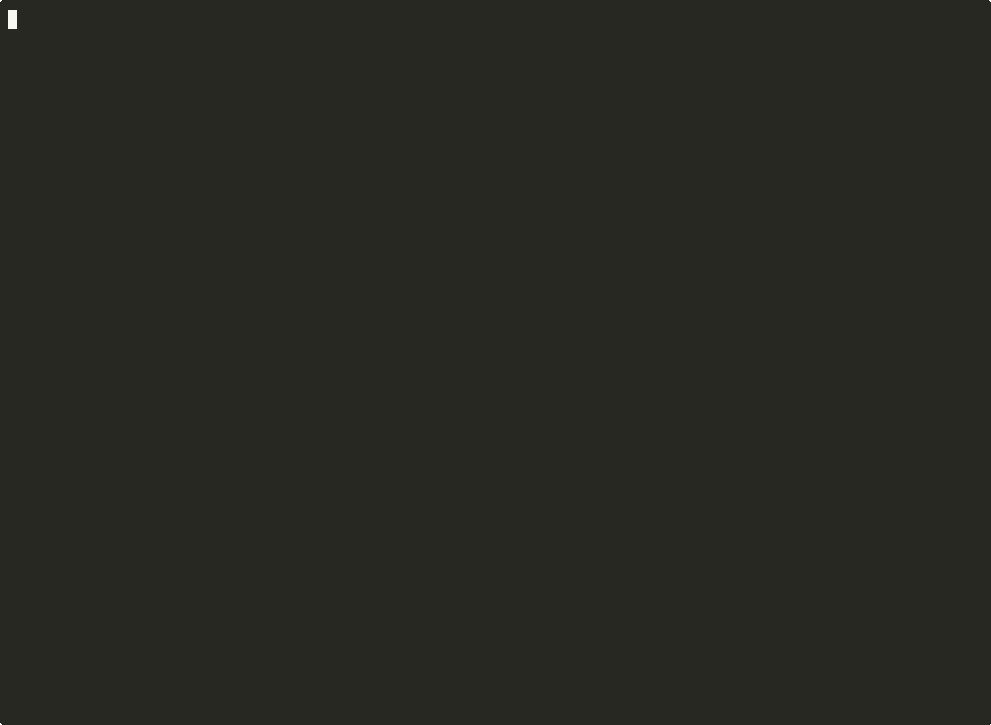
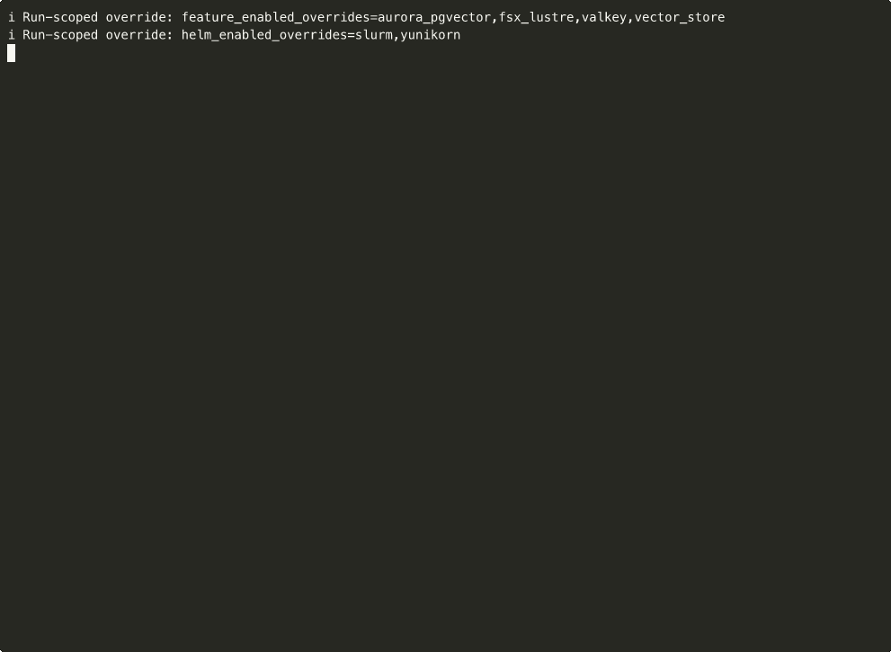
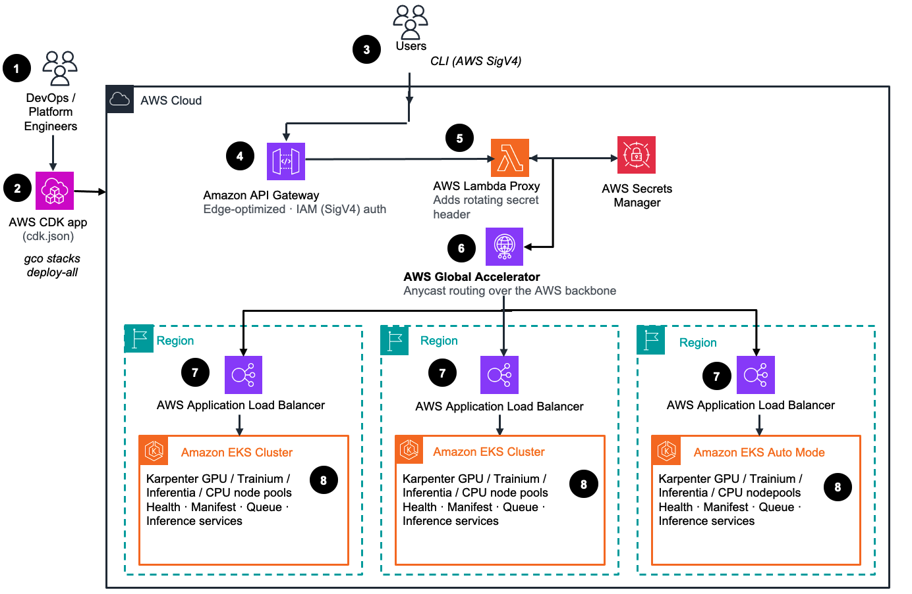
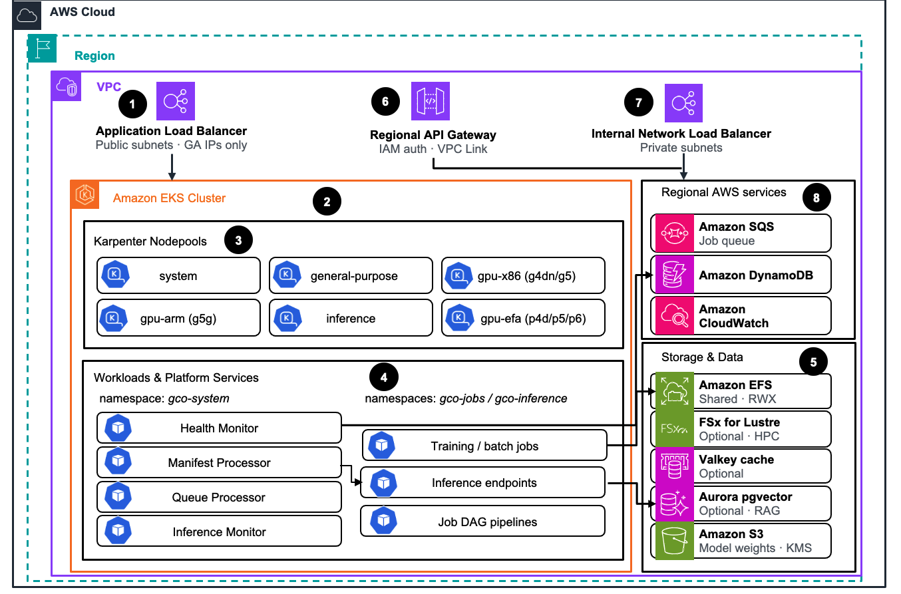
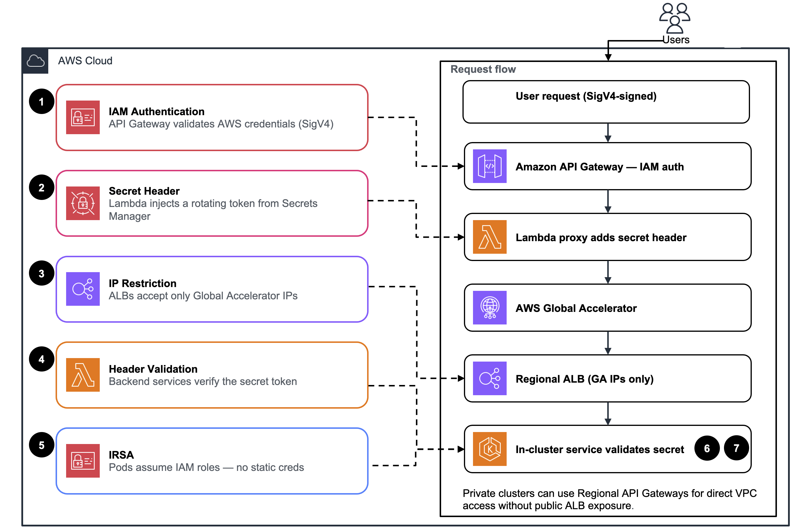

<div align="center">

<h1>Global Capacity Orchestrator (GCO)</h1>

<p><b><i>One API. Every Accelerator. Any Region.</i></b></p>

<p>Multi-region accelerated-compute orchestration for AWS — NVIDIA GPUs, AWS Trainium, AWS Inferentia, and CPU (amd64 + arm64 / Graviton) — with capacity-aware scheduling, spot fallback, and multi-region autoscaling inference endpoints with automatic failover and latency-aware routing, all from a single REST API and CLI.</p>

<!-- BEGIN BADGE TABLE -->
<p>
  <a href="https://github.com/awslabs/global-capacity-orchestrator-on-aws/actions/workflows/unit-tests.yml"></a>
  <a href="https://github.com/awslabs/global-capacity-orchestrator-on-aws/actions/workflows/integration-tests.yml"></a>
  <a href="https://github.com/awslabs/global-capacity-orchestrator-on-aws/actions/workflows/security.yml"></a>
  <a href="https://github.com/awslabs/global-capacity-orchestrator-on-aws/actions/workflows/lint.yml"></a>
  <a href="https://awslabs.github.io/global-capacity-orchestrator-on-aws/"></a>
</p>
<!-- END BADGE TABLE -->

<details>
<summary>🎬 Live demo recording</summary>



*`gco` CLI demo: capacity discovery, cost visibility, 5 schedulers (Volcano, Kueue, YuniKorn, Slurm, KEDA), FSx, Valkey, live LLM inference, and EFS — all against one already-deployed cluster. ([source](demo/live_demo.sh) · [re-record](demo/record_demo.sh))*

</details>

<details>
<summary>📦 Deploy recording</summary>


*Fresh `gco stacks deploy-all -y` from a clean account ([re-record](demo/record_deploy.sh))*

</details>

<details>
<summary>🗑️ Destroy recording</summary>



*Full teardown with `gco stacks destroy-all -y` ([re-record](demo/record_destroy.sh))*

</details>

</div>

**What it does.** Spins up [EKS Auto Mode](docs/CONCEPTS.md#eks-auto-mode) clusters across AWS regions, wired together with [Global Accelerator](docs/CONCEPTS.md#global-routing) for latency-aware anycast routing and automatic failover. Submit Kubernetes manifests via a single REST API or CLI — GCO handles capacity-aware scheduling, spot fallback, multi-region autoscaling inference endpoints, and output persistence.

**Who it's for.** Teams running accelerated workloads — LLM training and inference, batch ML, HPC, and general CPU jobs — that need multi-region redundancy, automatic capacity discovery, and IAM-based access without per-cluster kubeconfig distribution. Pre-wired [nodepools](docs/CONCEPTS.md#nodepools) for NVIDIA GPUs (g4dn, g5, and ARM64 g5g), AWS Trainium, AWS Inferentia, and general-purpose CPU on both amd64 and arm64 / Graviton.

**Why it's different.** Capacity-aware routing across regions out of the box, full-stack observability (CloudWatch dashboards, alarms, SNS), and a CDK app validated across 20+ config matrix combinations in CI.

---

**Deploy everything and tear it all down with one command each:**

```bash
gco stacks deploy-all -y      # stand up every region defined in cdk.json
gco stacks destroy-all -y     # destroy every stack across every region — no orphaned resources
```

**Recommended: run everything from the dev container.** GCO pins exact versions of a lot of Python packages (CDK, AWS SDKs, FastAPI, mypy, Ruff, etc.), and installing them on top of an existing Python environment is the most common source of "it doesn't install" reports. The dev container ships a fully resolved environment (Python 3.14, Node.js 24, CDK, kubectl, AWS CLI, all Python deps) so you skip the whole problem.

```bash
git clone git@github.com:awslabs/global-capacity-orchestrator-on-aws.git
cd global-capacity-orchestrator-on-aws

docker build -f Dockerfile.dev -t gco-dev .
docker run -it --rm \
  -v ~/.aws:/root/.aws:ro \
  -v $(pwd):/workspace \
  -v /var/run/docker.sock:/var/run/docker.sock \
  -w /workspace \
  gco-dev
```

The `docker.sock` mount lets `gco stacks deploy-all` bundle Lambda assets through your host Docker daemon. See [Prerequisites](#prerequisites) for Colima/Finch socket paths and the security note about host-socket pass-through.

<details>
<summary>Prefer to install on your host? (advanced — the dev container is recommended)</summary>

Host installs are the advanced, non-recommended path. GCO pins exact versions of many Python packages, so installing on top of an existing Python environment frequently fails with dependency-resolver errors (`ResolutionImpossible`). The dev container shown above is the recommended path — it ships every dependency at the pinned versions — and the [Quick Start Guide](QUICKSTART.md) walks through it end to end. If you still want a host install, use a clean virtual environment or pipx.

```bash
git clone git@github.com:awslabs/global-capacity-orchestrator-on-aws.git
cd global-capacity-orchestrator-on-aws && pipx install -e .
```

</details>

See the [Quick Start](#quick-start) for the full install + first-job walkthrough, or [`docs/CLI.md`](docs/CLI.md) for every CLI command.

> **💡 New to the codebase?** GCO ships with the **GCO MCP server** — an [MCP server](mcp/) exposing 98 tools by default (up to 130 with feature flags) that index the whole project: docs, examples, source code, K8s manifests, and scripts. Connect it to an AI-powered IDE with MCP support (like [Kiro](https://kiro.dev)) and explore GCO conversationally — ask questions about the codebase instead of reading repository files directly: *"How does region recommendation work?"*, *"Walk me through the inference deployment flow"*. See [mcp/README.md](mcp/README.md).

<details>
<summary><b>Table of contents</b></summary>

- [Why GCO?](#why-gco)
- [Quick Start](#quick-start)
- [Architecture Overview](#architecture-overview)
- [AWS Services in this Guidance](#aws-services-in-this-guidance)
- [Sample Cost Table](#sample-cost-table)
- [Supported AWS Regions](#supported-aws-regions)
- [Key Features](#key-features)
- [Documentation](#documentation)
- [Project Structure](#project-structure)
- [Contributing](#contributing)
- [License](#license)
- [Support](#support)
- [Security](#security)

</details>

## Why GCO?

Running GPU workloads at scale is hard. You need to find regions with available capacity, provision clusters, handle authentication, deal with failover, and persist outputs after pods terminate. GCO solves all of this with a single deployable platform.

| Challenge | Traditional Approach | With GCO |
|-----------|---------------------|--------------|
| GPU availability | Manually check each region | Auto-routes to available capacity |
| Node provisioning | Pre-provision or wait for scaling | EKS Auto Mode provisions on-demand |
| Multi-region ops | Manage clusters separately | Single API, automatic routing |
| Authentication | Configure per-cluster access | IAM-based, uses existing AWS credentials |
| Job outputs | Lost when pods terminate | Persisted to EFS/FSx storage |
| Inference serving | Deploy and manage per-region | Deploy once, serve globally |
| Failover | Manual intervention required | Automatic via Global Accelerator |

**When to use GCO:**

- You need to run GPU workloads (training, inference, batch processing)
- You want to deploy inference endpoints across multiple regions with a single command
- You want multi-region redundancy without managing multiple clusters
- You prefer IAM authentication over kubeconfig management
- You need job outputs to persist after completion

## Quick Start

### Install and Deploy

The fastest, most reliable path is the dev container — it sidesteps the dependency-conflict issues that come with installing GCO's pinned Python packages on top of your existing Python environment.

Build the dev container (Python, Node.js, CDK, kubectl, and the AWS CLI are all pinned and pre-installed), then drop into a shell with the `gco` CLI already on the path:

```bash
docker build -f Dockerfile.dev -t gco-dev .
docker run -it --rm \
  -v ~/.aws:/root/.aws:ro \
  -v $(pwd):/workspace \
  -v /var/run/docker.sock:/var/run/docker.sock \
  -w /workspace \
  gco-dev
```

From inside the container, deploy everything — CDK bootstrap runs automatically for every region defined in `cdk.json`:

```bash
gco stacks deploy-all -y
```

If you'd rather install on your host, use a clean virtual environment or pipx — see the [Prerequisites](#prerequisites) and [QUICKSTART.md](QUICKSTART.md) for the details and known caveats.

> **Heads up — Helm charts finish installing in the background.** When `deploy-all` reports the cluster `CREATE_COMPLETE`, the scheduler/operator Helm charts (KEDA, Volcano, KubeRay, cert-manager, Kueue, …) have only been *kicked off*; they converge asynchronously and can take **10–30+ minutes** to all become ready. This is intentional — a slow chart never rolls back the cluster. Track progress with `gco stacks addons status -r <region>` and re-converge any failures with `gco stacks addons install -r <region>`. See [docs/CUSTOMIZATION.md](docs/CUSTOMIZATION.md#helm-chart-configuration).

> **Optional:** configure kubectl access (requires `PUBLIC_AND_PRIVATE` endpoint mode). The default endpoint mode is `PRIVATE` — see [docs/CUSTOMIZATION.md](docs/CUSTOMIZATION.md) for details. Most users don't need this; submit jobs via SQS or API Gateway instead.

### Submit Your First Job

Check GPU capacity in a region before you submit:

```bash
gco capacity check --instance-type g4dn.xlarge --region us-east-1
```

Submit a job using whichever path fits your setup — via SQS (recommended), via the global DynamoDB queue, via API Gateway, or directly through kubectl:

```bash
gco jobs submit-sqs examples/simple-job.yaml --region us-east-1
gco queue submit examples/simple-job.yaml --region us-east-1
gco jobs submit examples/simple-job.yaml -n gco-jobs
gco jobs submit-direct examples/simple-job.yaml -r us-east-1
```

Check status and pull logs:

```bash
gco jobs list --all-regions
gco jobs logs hello-gco -n gco-jobs -r us-east-1
```

### Deploy an Inference Endpoint

```bash
gco inference deploy my-llm -i vllm/vllm-openai:v0.22.0 --gpu-count 1
gco inference status my-llm
gco inference scale my-llm --replicas 3
```

See the [Quick Start Guide](QUICKSTART.md) for the full step-by-step walkthrough, or the [CLI Reference](docs/CLI.md) for all available commands.

## Architecture Overview



*Figure 1: Global Capacity Orchestrator — multi-region control plane and regional EKS data planes*

### Multi-Region Reference Architecture workflow

1. **DevOps / Platform engineers** own the deployment. They configure the platform through `cdk.json` and drive everything from the `gco` CLI.
2. The **AWS CDK app** synthesises and deploys the GCO stacks with a single `gco stacks deploy-all`, provisioning the global control plane and one regional stack per target region.
3. **Users** submit jobs and inference requests through the `gco` CLI, which signs every call with **AWS SigV4** credentials.
4. **Amazon API Gateway** (edge-optimized) is the global entry point. It enforces **IAM (SigV4) authentication** on every request before anything reaches the backend.
5. An **AWS Lambda proxy** injects a rotating secret header sourced from **AWS Secrets Manager**, adding a second authentication factor in front of the regional load balancers.
6. **AWS Global Accelerator** routes each request over the AWS backbone via anycast IPs to the nearest healthy region, providing automatic cross-region failover.
7. A regional **AWS Application Load Balancer** receives Global Accelerator traffic and forwards it into the cluster. ALBs accept only Global Accelerator IPs.
8. Each region runs an **Amazon EKS cluster** (EKS Auto Mode optional) with Karpenter GPU / Trainium / Inferentia / CPU node pools plus the GCO platform services — Health Monitor, Manifest Processor, Queue Processor, and Inference endpoints.

Below is the per-region view showing how a single regional stack is composed.



*Figure 2: Regional stack — EKS cluster, Karpenter node pools, platform services, and regional AWS services*

### Regional Architecture workflow

1. A public-subnet **Application Load Balancer** accepts inbound traffic restricted to Global Accelerator IPs only.
2. The **Amazon EKS cluster** is the heart of the regional stack, hosting both platform services and user workloads.
3. **Karpenter node pools** provision capacity on demand across `system`, `general-purpose`, `gpu-x86` (g4dn/g5), `gpu-arm` (g5g), `inference`, and `gpu-efa` (p4d/p5/p6) pools.
4. **Workloads & platform services** run across namespaces: `gco-system` (Health Monitor, Manifest Processor, Queue Processor, Inference Monitor) and `gco-jobs` / `gco-inference` (training and batch jobs, inference endpoints, and job DAG pipelines).
5. **Storage & data** services back the workloads: Amazon EFS (shared RWX), optional FSx for Lustre (HPC), optional Valkey cache, optional Aurora pgvector (RAG), and Amazon S3 for KMS-encrypted model weights.
6. An optional **Regional API Gateway** (IAM auth over a VPC Link) provides direct in-VPC access for private clusters without public ALB exposure.
7. An internal **Network Load Balancer** in private subnets fronts in-cluster services for VPC-internal traffic.
8. **Regional AWS services** complete the stack: Amazon SQS for the job queue, Amazon DynamoDB for state, and Amazon CloudWatch for metrics and logs.

<details>
<summary>📊 Full Architecture Diagram (click to expand)</summary>


</details>

Regenerate this diagram and every per-stack view on demand with `python diagrams/infra_diagrams/generate.py` — it synthesises the current CDK app through AWS PDK cdk-graph so the diagrams never drift from the source. See [`diagrams/infra_diagrams/README.md`](diagrams/infra_diagrams/README.md) for per-stack flags (`--stack global|api-gateway|regional|regional-api|monitoring|analytics|all`). Flowcharts of the code itself (Lambda handlers, CLI commands) live alongside them under [`diagrams/code_diagrams/`](diagrams/code_diagrams/README.md).

> The regional stack can be deployed to any AWS region. Add or remove regions by editing the `deployment_regions.regional` array in `cdk.json`.

### Security Model



*Figure 3: Defense-in-depth — five security layers applied across the request flow*

Five layers protect every request:

1. **IAM Authentication** — API Gateway validates AWS credentials (SigV4)
2. **Secret Header** — Lambda injects a rotating token from Secrets Manager
3. **IP Restriction** — ALBs only accept Global Accelerator IPs
4. **Header Validation** — Backend services verify the secret token
5. **IRSA** — Pods assume IAM roles for AWS access (no static credentials)

```text
Request flow: User → API Gateway (SigV4) → Lambda (adds secret) → Global Accelerator
  → ALB (GA IPs only) → Services (validate secret)
```

For private clusters, [Regional API Gateways](docs/CUSTOMIZATION.md#regional-api-gateway-private-access) provide direct VPC access without public ALB exposure.

See [Architecture Details](docs/ARCHITECTURE.md) for the full deep dive.

## AWS Services in this Guidance

| AWS Service | Usage |
|-------------|-------|
| [Amazon EKS](https://aws.amazon.com/eks/) | Kubernetes control plane and Auto Mode compute (GPU, Trainium, Inferentia, CPU nodepools) |
| [AWS Global Accelerator](https://aws.amazon.com/global-accelerator/) | Anycast endpoint with health-based cross-region routing and automatic failover |
| [Amazon API Gateway](https://aws.amazon.com/api-gateway/) | IAM-authenticated (SigV4) REST entry point for job submission and inference |
| [AWS Lambda](https://aws.amazon.com/lambda/) | Proxy functions (auth header injection, GA registration), manifest application, Helm chart installation orchestration |
| [AWS Step Functions](https://aws.amazon.com/step-functions/) | Orchestrates Helm chart installs — one state per chart with per-chart retry and backoff |
| [Amazon DynamoDB](https://aws.amazon.com/dynamodb/) | Inference endpoint desired-state store, job queue state, and template storage |
| [Amazon SQS](https://aws.amazon.com/sqs/) | Regional job ingestion queue with dead-letter queue and KEDA-driven scale-to-zero consumer |
| [Amazon S3](https://aws.amazon.com/s3/) | Model weight storage (KMS-encrypted), cluster shared bucket, CDK asset staging |
| [Amazon EFS](https://aws.amazon.com/efs/) | Shared elastic storage for job outputs, model weights, and inter-pod data sharing |
| [Amazon FSx for Lustre](https://aws.amazon.com/fsx/lustre/) | Optional high-performance parallel file system for ML training workloads |
| [Amazon ElastiCache (Valkey)](https://aws.amazon.com/elasticache/) | Optional serverless key-value cache for prompt caching and session state |
| [Amazon Aurora](https://aws.amazon.com/rds/aurora/) | Optional Serverless v2 PostgreSQL with pgvector for RAG and semantic search |
| [Amazon ECR](https://aws.amazon.com/ecr/) | Container image registry with cross-region replication for platform and user images |
| [Amazon CloudWatch](https://aws.amazon.com/cloudwatch/) | Metrics, logs, alarms, dashboards, and Container Insights for GPU utilization |
| [Amazon SNS](https://aws.amazon.com/sns/) | Alert notifications for drift detection, health issues, and capacity events |
| [AWS Secrets Manager](https://aws.amazon.com/secrets-manager/) | Rotating auth tokens for ALB header validation |
| [AWS KMS](https://aws.amazon.com/kms/) | Encryption keys for S3 model buckets, EFS, and secrets |
| [AWS IAM](https://aws.amazon.com/iam/) | IRSA roles for pod-level AWS access, service roles, and SigV4 authentication |
| [AWS CDK](https://aws.amazon.com/cdk/) | Infrastructure as code — synthesizes, validates (cdk-nag), and deploys all stacks |
| [Amazon VPC](https://aws.amazon.com/vpc/) | Network isolation with public/private subnets, NAT Gateways, and VPC endpoints |
| [AWS Cost Explorer](https://aws.amazon.com/aws-cost-management/aws-cost-explorer/) | Cost tracking by service, region, and workload via the `gco costs` commands |

## Sample Cost Table

The following estimates are for a single-region deployment with default settings. Multi-region deployments scale linearly. Costs vary by region, instance type, and utilization.

| Resource | Configuration | Estimated Monthly Cost (USD) |
|----------|--------------|------------------------------|
| EKS cluster | 1 cluster (Auto Mode) | ~$73 |
| NAT Gateways | 2 (high availability) | ~$65 |
| Application Load Balancer | 1 (shared by all services) | ~$22 |
| Global Accelerator | 1 accelerator + data transfer | ~$18 + transfer |
| Lambda functions | ~8 functions, minimal invocations | < $1 (often $0 within free tier) |
| Step Functions | ~10 state transitions per deploy | < $1 |
| DynamoDB | On-demand, low throughput | ~$5 |
| SQS | Standard queue, low message volume | < $1 |
| S3 | Model storage (varies with model size) | ~$2 (10 GB + API requests) |
| EFS | Elastic storage (varies with usage) | ~$3 (10 GB stored) |
| CloudWatch | Logs, metrics, Container Insights | ~$15 |
| ECR | Image storage + replication | ~$5 |
| Secrets Manager | 1 secret with rotation | < $1 |
| **Subtotal (platform, no GPU workloads)** | | **~$210/month** |
| GPU instances (example) | 1× g5.xlarge on-demand, 24/7 (us-east-1) | ~$734 |
| GPU instances (spot) | 1× g5.xlarge spot, 24/7 (us-east-1) | ~$250 |

**Notes:**

- Platform costs (~$210/month) are fixed regardless of workload volume.
- GPU costs dominate and scale with the number of instances and hours run. Use `gco costs summary` to track actual spend.
- GPU estimates assume an on-demand g5.xlarge in us-east-1 at ~$1.006/hr (~$734/month over 730 hours); rates vary by region and instance type.
- Optional services (FSx, Valkey, Aurora) add additional cost depending on configuration.
- The cost table above uses US East (N. Virginia) pricing as of June 2025.

## Supported AWS Regions

GCO can be deployed to any AWS region that supports Amazon EKS, AWS Global Accelerator, and the other services listed above. The deployment regions are configured in `cdk.json` under `deployment_regions.regional`.

**Tested and validated regions:**

| Region | Location |
|--------|----------|
| us-east-1 | N. Virginia |
| us-east-2 | Ohio |
| us-west-2 | Oregon |
| eu-west-1 | Ireland |
| eu-west-2 | London |
| eu-central-1 | Frankfurt |
| ap-southeast-1 | Singapore |
| ap-northeast-1 | Tokyo |

**Adding a new region:**

```json
// cdk.json
{
  "context": {
    "deployment_regions": {
      "regional": ["us-east-1", "eu-west-1", "ap-northeast-1"]
    }
  }
}
```

Then redeploy: `gco stacks deploy-all -y`. CDK bootstrap runs automatically for new regions.

GPU instance availability varies by region. Use `gco capacity check -i <instance-type> -r <region>` or `gco capacity recommend-region --gpu` to find regions with available GPU capacity before deploying workloads.

## Key Features

### Compute & Orchestration

- **EKS Auto Mode** with automatic node provisioning — no pre-scaling needed
- **GPU support** for x86_64 (g4dn, g5) and ARM64 (g5g) via Karpenter nodepools
- **Multiple submission methods**: API Gateway, SQS queues, DynamoDB job queue, or direct kubectl
- **Job pipelines (DAGs)**: Multi-step ML pipelines with dependency ordering and failure handling
- **Helm-managed ecosystem**: KEDA, Volcano, KubeRay, Kueue, DRA, and more — configurable via `cdk.json`

### Inference Serving

- **Multi-region inference**: Deploy endpoints (vLLM, TGI, Triton, TorchServe, SGLang) across regions with a single command
- **Canary deployments**: A/B test new model versions with weighted traffic routing
- **Model weight management**: Central S3 bucket with KMS encryption, automatic sync to each region
- **Spot instance support**: Run inference on spot GPUs for significant cost savings
- **Autoscaling**: HPA-based scaling with CPU/memory metrics

### Networking & Security

- **Global Accelerator**: Single anycast endpoint with automatic failover
- **IAM authentication**: SigV4 at the API Gateway — no kubeconfig distribution
- **Compliance validated**: CDK-nag checks for AWS Solutions, HIPAA, NIST 800-53, PCI DSS
- **Network policies**: Default-deny with explicit allow rules for all service communication
- **EFA support**: Optional Elastic Fabric Adapter for high-bandwidth distributed training and NIXL-based inference (toggle on/off)

### Storage & Data

- **EFS**: Shared elastic storage for job outputs that persist after pod termination
- **FSx for Lustre**: Optional high-performance parallel file system for ML training (toggle on/off)
- **Valkey cache**: Optional serverless key-value cache for prompt caching and session state
- **Aurora pgvector**: Optional serverless vector database for RAG, semantic search, and embedding storage

### Operations

- **Cost visibility**: Track spend by service, region, and workload via Cost Explorer integration
- **Auto-bootstrap**: CDK bootstrap runs automatically for new regions during deploy
- **Multi-region monitoring**: CloudWatch dashboards, alarms, and SNS alerts across all regions

### ML & Analytics Environment

- **ML & Analytics Environment**: Optional SageMaker Studio domain + EMR Serverless + Cognito user pool for interactive notebook analytics, with an always-on `Cluster_Shared_Bucket` that all cluster jobs can read and write. Off by default — enable with `gco analytics enable`. See [Analytics Guide](docs/ANALYTICS.md).

### Mission

Goal-directed iteration loop for orchestrated workflows. The operator declares a natural-language directive plus machine-checkable success criteria, a tool allowlist, and a budget; Mission runs five-phase iterations (propose → execute → observe → evaluate → decide) until a verdict is reached. Off by default — enable with `GCO_ENABLE_MISSION=true`. See [Mission Guide](docs/MISSION.md).

- **Deterministic verdict cascade** with optional advisory LLM sampling (MCP host or Amazon Bedrock). Sampling shapes only the next strategy; it never moves the verdict.
- **Budget caps** on iterations and wall clock — the engine terminates cleanly when any cap fires. Cost guardrails live out-of-band via AWS Budgets and Cost Anomaly Detection at the account level.
- **Scripted strategies** opt-in: an AST-validated Python sandbox with bounded duration and memory limits.
- **CLI + MCP surface**: ten `gco mission` subcommands (including the chained `gco mission run` that scaffolds criteria and drives a session to completion in one call) and matching MCP tools, plus three `mission://sessions/{id}` resource templates.

## Documentation

**New to GCO?** Start here:

| Your Goal | Read This |
|-----------|-----------|
| Understand what GCO does | [Core Concepts](docs/CONCEPTS.md) |
| Get running in under 60 minutes | [Quick Start Guide](QUICKSTART.md) |
| Learn the architecture | [Architecture Details](docs/ARCHITECTURE.md) |
| Browse every guide in one place | [Documentation Index](docs/README.md) |

**Day-to-day operations:**

| Your Goal | Read This |
|-----------|-----------|
| CLI commands and usage | [CLI Reference](docs/CLI.md) |
| Deploy inference endpoints | [Inference Guide](docs/INFERENCE.md) |
| Use the REST API directly | [API Reference](docs/API.md) |
| Fix issues | [Troubleshooting](docs/TROUBLESHOOTING.md) |
| Respond to incidents | [Operational Runbooks](docs/RUNBOOKS.md) |
| Run interactive notebook analytics | [Analytics Guide](docs/ANALYTICS.md) |
| Drive a goal-directed iteration loop | [Mission Guide](docs/MISSION.md) |

**Customization and development:**

| Your Goal | Read This |
|-----------|-----------|
| Add regions, tune nodepools, enable FSx | [Customization Guide](docs/CUSTOMIZATION.md) |
| Choose a scheduler for your workload | [Schedulers & Orchestrators](docs/SCHEDULERS.md) |
| Configure the SQS queue processor | [Queue Processor Config](docs/CUSTOMIZATION.md#queue-processor-sqs-consumer) |
| Contribute to the project | [Contributing](CONTRIBUTING.md) |
| API client examples (Python, curl, AWS CLI) | [Client Examples](docs/client-examples/README.md) |
| IAM policy templates | [IAM Policies](docs/iam-policies/README.md) |
| Presentation slides and demo scripts | [Demo Starter Kit](demo/README.md) |

### Prerequisites

**Recommended path — dev container only:**

- AWS CLI configured with appropriate credentials (or `~/.aws` to mount in)
- Docker (or Finch / Colima) — that's it. The container ships Python 3.14, Node.js 24, CDK, kubectl, and AWS CLI at pinned versions.

```bash
docker build -f Dockerfile.dev -t gco-dev .
docker run -it --rm -v ~/.aws:/root/.aws:ro -v $(pwd):/workspace -w /workspace gco-dev
```

For `gco stacks deploy-all`, `cdk deploy` needs to run Docker to bundle Lambda assets. Mount the host Docker socket so the container's CLI talks to your host daemon (works with Docker Desktop on macOS/Windows, with Docker on Linux, and with Colima on macOS — see `Dockerfile.dev` for Colima-specific socket paths):

```bash
docker run --rm -it \
  -v ~/.aws:/root/.aws:ro \
  -v $(pwd):/workspace \
  -v /var/run/docker.sock:/var/run/docker.sock \
  -w /workspace \
  gco-dev gco stacks deploy-all -y
```

This is host-socket pass-through, not true Docker-in-Docker. Anyone with access to the container has root-equivalent access to the host Docker daemon, so keep the container on a trusted host.

**Host install path (advanced):**

- AWS CLI configured with appropriate credentials
- Python 3.14+ and Node.js LTS (v24)
- AWS CDK CLI (`npm install -g aws-cdk`)
- Docker or Finch (for building container images)
- A **clean** Python virtual environment or pipx — GCO pins exact versions of many packages, so installing it into an existing environment will commonly fail with dependency-resolver errors. If you hit `ResolutionImpossible`, switch to the dev container instead of debugging your local env.

## Project Structure

```text
.
├── app.py                               # CDK app entry point
├── cdk.json                             # CDK configuration (regions, features, thresholds)
├── pyproject.toml                       # Project metadata, dependencies, and CLI installation
│
├── cli/                                 # GCO CLI (jobs, stacks, capacity, inference, costs, DAGs)
├── diagrams/                            # Auto-generated architecture diagrams (infra_diagrams/) and code flowcharts (code_diagrams/)
├── docs/                                # Documentation (architecture, CLI, API, inference, customization, analytics)
├── examples/                            # Example manifests (jobs, inference, Ray, Volcano, Kueue, Slurm, YuniKorn)
├── gco/
│   ├── config/                          # Configuration loader with validation
│   ├── models/                          # Data models for k8s clusters, health monitor, inference monitor and manifest processor
│   ├── services/                        # K8s services (health monitor, inference monitor, manifest processor, queue processor)
│   └── stacks/                          # CDK stacks (global, regional, API gateway, monitoring)
│       └── constants.py                 # Pinned versions: EKS addons, Lambda runtime, Aurora engine
│
├── lambda/                              # Lambda functions
│   ├── alb-header-validator/            # ALB header validation for auth tokens
│   ├── analytics-cleanup/               # Custom resource that deletes Studio user profiles + EFS access points on stack destroy
│   ├── analytics-presigned-url/         # Generates presigned SageMaker Studio URLs for Cognito-authenticated users
│   ├── api-gateway-proxy/               # API Gateway → Global Accelerator proxy
│   ├── cross-region-aggregator/         # Cross-region job/health aggregation
│   ├── drift-detection/                 # Scheduled drift checks against deployed CDK stacks
│   ├── ga-registration/                 # Global Accelerator endpoint registration
│   ├── helm-installer/                  # Installs Helm charts (schedulers, cert-manager)
│   │   └── charts.yaml                  # Helm chart configuration (schedulers, cert-manager)
│   ├── image-lookup/                    # Adopt-or-create custom resource for the project's gco/* ECR repositories
│   ├── kubectl-applier-simple/          # Applies K8s manifests during deployment
│   │   └── manifests/                   # Kubernetes manifests (nodepools, RBAC, services, storage)
│   ├── proxy-shared/                    # Shared utilities for proxy Lambdas
│   ├── regional-api-proxy/              # Regional API Gateway → internal ALB proxy
│   └── secret-rotation/                 # Daily secret rotation
│
├── mcp/                                 # MCP server for LLM interaction (98 tools default, up to 130 with feature flags)
├── scripts/                             # Utility scripts (version bump, cluster access setup)
└── tests/                               # PyTest + BATS test suites (counts tracked via badges)
```

## Contributing

See [CONTRIBUTING.md](CONTRIBUTING.md) for development setup, testing, the GitHub Actions CI/CD layout, release process, and dependency scanning schedules.

Quick start for contributors (dev container — recommended):

```bash
docker build -f Dockerfile.dev -t gco-dev .
docker run --rm -v $(pwd):/workspace -w /workspace gco-dev pytest tests/ -v --cov=gco --cov=cli --cov=mcp
```

Or, in a clean virtual environment on your host:

```bash
python3 -m venv .venv && source .venv/bin/activate
pip install -e ".[dev]"
pytest tests/ -v --cov=gco --cov=cli --cov=mcp
```

> If `pip install -e ".[dev]"` fails with dependency-resolver errors, that's the pinned-versions issue mentioned in [Prerequisites](#prerequisites). Use the dev container instead — it ships everything at the exact versions CI uses.

## License

See the [LICENSE](LICENSE) file for details.

## Support

- Check [Troubleshooting](docs/TROUBLESHOOTING.md) for common issues
- Review CloudWatch logs for Lambda and EKS errors
- Open an issue on [GitHub](https://github.com/awslabs/global-capacity-orchestrator-on-aws/issues)

## Security

GCO implements defense-in-depth across five layers (see [Security Model](#security-model) above for the diagram):

**Authentication and Authorization:**

- All API requests require AWS IAM (SigV4) authentication at the API Gateway
- A Lambda-injected rotating secret from AWS Secrets Manager adds a second factor
- IRSA (IAM Roles for Service Accounts) provides pod-level AWS access with no static credentials
- EKS access entries with explicit policy bindings (no aws-auth ConfigMap)

**Network Security:**

- ALBs only accept traffic from Global Accelerator IP ranges
- EKS clusters run in private subnets with configurable endpoint access (PRIVATE or PUBLIC_AND_PRIVATE)
- VPC endpoints eliminate traffic traversal over the public internet for ECR, S3, STS, SSM, and CloudWatch
- VPC Flow Logs (30-day retention) capture all network traffic for audit
- Kubernetes Network Policies enforce default-deny with explicit allow rules

**Encryption:**

- Data at rest: S3 (KMS), EFS (KMS), EBS (KMS), DynamoDB (AWS-managed), Secrets Manager (KMS)
- Data in transit: TLS 1.2+ for all connections including EFS mounts
- Kubernetes secrets encrypted in etcd (EKS-managed encryption)

**Compliance Validation:**

- CDK-nag runs automatically during synthesis and deployment, validating against:
  - AWS Solutions best practices
  - HIPAA Security Rule
  - NIST 800-53 Rev 5
  - PCI DSS 3.2.1
  - Serverless best practices
- All suppressions are documented with justifications in `gco/stacks/nag_suppressions.py`

**Supply Chain Security:**

- Container images scanned with Trivy on every push (CVE detection)
- Python dependencies audited with pip-audit (GHSA/CVE detection)
- Dependency versions pinned with exact hashes in `requirements-lock.txt`
- Dependabot and CodeQL enabled for automated vulnerability alerts
- SBOM generation via Trivy for all container images

**Vulnerability Disclosure:**
For security issues, **do not open a public GitHub issue.** See [`.github/SECURITY.md`](.github/SECURITY.md) for the responsible disclosure process.

---
