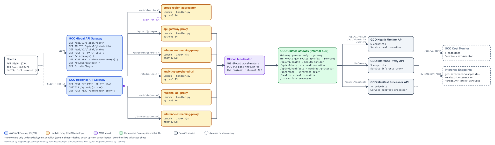

# GCO API Spec Sheets

<!-- Generated by diagrams/api_specs/generate.py from docs/openapi/*.json. Do not edit by hand; regenerate with `python diagrams/generate.py --api-only`. -->

One spec sheet per HTTP surface of GCO, rendered from the OpenAPI document that
describes it: for each FastAPI **service** the document the application
generates itself (the one behind its automatic Swagger `/docs` page); for each
AWS **API Gateway** the document read out of the synthesized CDK stack; and for
the in-cluster **Gateway** (the internal ALB) the document composed from its
HTTPRoute and the service documents. The documents are committed under
`docs/openapi/`, each guarded by a `--check` in CI, and these sheets are a
deterministic rendering of them — so a route, parameter or model change shows up
here in the same pull request as the code.

| Document | Kind | API | Version | Endpoints | OpenAPI document | Swagger UI |
|---|---|---|---|---|---|---|
| [`api-gateway-global`](api-gateway-global.md) | API Gateway | GCO Global API Gateway | `1.0.0` | 14 | [`json`](https://github.com/aws-solutions-library-samples/global-capacity-orchestrator-on-aws/blob/main/docs/openapi/api-gateway-global.json) | [`/docs`](https://aws-solutions-library-samples.github.io/global-capacity-orchestrator-on-aws/swagger/api-gateway-global/) |
| [`api-gateway-regional`](api-gateway-regional.md) | API Gateway | GCO Regional API Gateway | `1.0.0` | 10 | [`json`](https://github.com/aws-solutions-library-samples/global-capacity-orchestrator-on-aws/blob/main/docs/openapi/api-gateway-regional.json) | [`/docs`](https://aws-solutions-library-samples.github.io/global-capacity-orchestrator-on-aws/swagger/api-gateway-regional/) |
| [`cluster-gateway`](cluster-gateway.md) | Gateway | GCO Cluster Gateway (internal ALB) | `1.0.0` | 44 | [`json`](https://github.com/aws-solutions-library-samples/global-capacity-orchestrator-on-aws/blob/main/docs/openapi/cluster-gateway.json) | [`/docs`](https://aws-solutions-library-samples.github.io/global-capacity-orchestrator-on-aws/swagger/cluster-gateway/) |
| [`cost-monitor`](cost-monitor.md) | Service | GCO Cost Monitor | `1.0.0` | 5 | [`json`](https://github.com/aws-solutions-library-samples/global-capacity-orchestrator-on-aws/blob/main/docs/openapi/cost-monitor.json) | [`/docs`](https://aws-solutions-library-samples.github.io/global-capacity-orchestrator-on-aws/swagger/cost-monitor/) |
| [`health-monitor`](health-monitor.md) | Service | GCO Health Monitor API | `1.0.0` | 6 | [`json`](https://github.com/aws-solutions-library-samples/global-capacity-orchestrator-on-aws/blob/main/docs/openapi/health-monitor.json) | [`/docs`](https://aws-solutions-library-samples.github.io/global-capacity-orchestrator-on-aws/swagger/health-monitor/) |
| [`inference-proxy`](inference-proxy.md) | Service | GCO Inference Proxy API | `1.0.0` | 9 | [`json`](https://github.com/aws-solutions-library-samples/global-capacity-orchestrator-on-aws/blob/main/docs/openapi/inference-proxy.json) | [`/docs`](https://aws-solutions-library-samples.github.io/global-capacity-orchestrator-on-aws/swagger/inference-proxy/) |
| [`manifest-processor`](manifest-processor.md) | Service | GCO Manifest Processor API | `2.0.0` | 37 | [`json`](https://github.com/aws-solutions-library-samples/global-capacity-orchestrator-on-aws/blob/main/docs/openapi/manifest-processor.json) | [`/docs`](https://aws-solutions-library-samples.github.io/global-capacity-orchestrator-on-aws/swagger/manifest-processor/) |

The **Swagger UI** column is the Swagger console for each document (FastAPI's own
`/docs` page for the services), served from the project site under `/swagger/`
with a self-hosted copy of `swagger-ui-dist` (the site makes no third-party
requests). It is built at deploy time by `pages.yml`; the sheets in this directory
are also staged into the wiki's source tree under `/api/` by `scripts/build_wiki.py`,
so both renderings come from one source.

## How the surfaces fit together



Drawn from the same documents: a client signs a request with SigV4 to one of the
two API Gateways; a Lambda proxy adds the request-bound HMAC envelope and forwards
it — over Global Accelerator from the global API, inside the VPC from the regional
bridge — to the region's internal ALB, the Kubernetes Gateway whose HTTPRoute picks
the Service by longest path prefix. The aggregator answers `/api/v1/global/*` by
fanning out to the regional API Gateways. Dashed arrows are opt-in or dynamic
paths; `†` marks routes that exist only under a deployment condition. Every box
is a document in the table above, and each is a link to its sheet on the site.

## Regenerating

```bash
python scripts/generate_openapi.py                  # refresh the service documents from the apps
python scripts/generate_api_gateway_openapi.py      # re-synthesize the API Gateway documents
python scripts/generate_cluster_gateway_openapi.py  # recompose the cluster gateway document
python diagrams/generate.py --api-only              # rewrite these sheets, this index and the diagram
python diagrams/generate.py --check                 # fail if anything here is stale
```

To browse the consoles locally, install the locked npm tooling and serve the
generated tree:

```bash
npm ci --ignore-scripts --no-audit --no-fund
python diagrams/api_specs/generate.py --swagger-ui-dir /tmp/gco-swagger \
    --swagger-assets node_modules/swagger-ui-dist
python -m http.server --directory /tmp/gco-swagger 8080
```

Swagger UI loads the document with a browser request, so the tree has to be
served over HTTP rather than opened from the filesystem.
