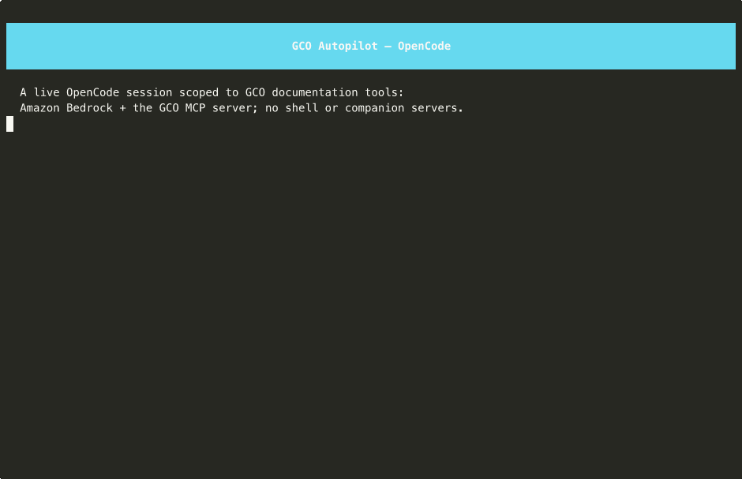

# Autopilot

One command turns a plain terminal into a fully configured agent session:

```bash
gco autopilot                         # Claude Code (default)
gco autopilot --engine codex          # OpenAI Codex
gco autopilot --engine opencode       # OpenCode
```

Every engine uses Amazon Bedrock with your AWS credentials, the GCO MCP
server, and the recommended companion MCP servers. Claude Code remains the
default for backward compatibility; selecting Codex or OpenCode is explicit and
does not change an existing workflow.

<details>
<summary>Claude Code recording (click to expand)</summary>


*A real Claude Code session grounded by the GCO MCP server
([re-record](../demo/record_autopilot.sh)).*

</details>

<details>
<summary>Codex recording (click to expand)</summary>


*A real Bedrock-backed Codex session grounded by only the GCO MCP
`find_docs` and `read_resource` tools. The recording disables companions and
shell access and fails on trust/approval prompts ([docs](#security-notes) ·
[re-record](../demo/record_autopilot.sh) with
`DEMO_ENGINE=codex DEMO_MODE=live`).*

</details>

<details>
<summary>OpenCode recording (click to expand)</summary>



*A real Bedrock-backed OpenCode session (Kimi K3) grounded by only the GCO MCP
`find_docs` and `read_resource` tools. The recording disables companions and
denies every built-in OpenCode tool, and fails on permission prompts
([docs](#security-notes) · [re-record](../demo/record_autopilot.sh) with
`DEMO_ENGINE=opencode DEMO_MODE=live`).*

</details>

## What Autopilot Provides

| Capability | Claude Code | Codex | OpenCode |
|---|---|---|---|
| Engine selection | Default | `--engine codex` or `GCO_AUTOPILOT_ENGINE=codex` | `--engine opencode` or `GCO_AUTOPILOT_ENGINE=opencode` |
| Bedrock default | `context.bedrock.claude_code_default_model_id` | `context.bedrock.codex_default_model_id` | `context.bedrock.opencode_default_model_id` |
| Generated config | `~/.gco/autopilot/mcp.json` | `~/.gco/autopilot/codex/config.toml` | `~/.gco/autopilot/opencode/opencode.json` |
| Isolation | `--strict-mcp-config` | Isolated `CODEX_HOME`, project config disabled per launch, and session-precedence Bedrock controls | `OPENCODE_CONFIG` merged above the user config, project config disabled per launch, and the model repeated on argv |
| Canonical reasoning | Model-native Claude configuration | `context.bedrock.codex.reasoning_effort` (`xhigh` for the shipped default) | Model-native (the shipped Kimi K3 default reasons on its own; no engine knob) |
| Background/fast model | `--small-fast-model` → `ANTHROPIC_SMALL_FAST_MODEL` | Not supported | `--small-fast-model` → `small_model` (pinned to the session model by default) |
| Lazy npm package | `@anthropic-ai/claude-code` | `@openai/codex` | `opencode-ai` |
| Imported context | Skills, agents, and plugins | Skills (copied) | Skills (referenced through `skills.paths`) |
| Resume mapping | `--continue`, `--resume [ID]` | `codex resume --last`, `codex resume [ID]` | `opencode --continue`, `opencode --session ID` |

The selected CLI is deliberately not baked into `gco-dev`. Autopilot detects
its binary and offers the exact pinned npm install on first use. The monthly
dependency scan reports drift for all three pins.

## Table of Contents

- [The Front Door](#the-front-door)
- [Requirements](#requirements)
- [Quick Start](#quick-start)
- [Choosing an Engine](#choosing-an-engine)
- [Choosing a Model and Reasoning](#choosing-a-model-and-reasoning)
- [Region Resolution](#region-resolution)
- [Generated Configuration and Isolation](#generated-configuration-and-isolation)
- [Resuming Sessions](#resuming-sessions)
- [GCO MCP Feature Flags](#gco-mcp-feature-flags)
- [Bring Your Own Context](#bring-your-own-context)
- [Passing Native Engine Arguments](#passing-native-engine-arguments)
- [Dev-Container Persistence](#dev-container-persistence)
- [Security Notes](#security-notes)
- [Mission Compatibility](#mission-compatibility)
- [How It Is Tested and Kept Fresh](#how-it-is-tested-and-kept-fresh)
- [Troubleshooting](#troubleshooting)

## The Front Door

With Git and a container runtime installed, this is the whole journey:

```bash
git clone https://github.com/aws-solutions-library-samples/global-capacity-orchestrator-on-aws.git
cd global-capacity-orchestrator-on-aws
./scripts/setup-dev-alias.sh
source ~/.zshrc                       # or ~/.bashrc; the script prints the target
gco autopilot                         # default Claude Code session
gco autopilot --engine codex          # or a Codex session
gco autopilot --engine opencode       # or an OpenCode session
```

The setup script builds `gco-dev` and installs a shell function that runs each
`gco` command against the current checkout. It also supplies the persistent
mounts every Autopilot engine needs; see
[Dev-Container Persistence](#dev-container-persistence).

## Requirements

- AWS credentials with `bedrock:InvokeModel`. Claude and OpenCode require the
  selected model/profile resource (OpenCode calls the Bedrock Converse API
  through the AI SDK's `amazon-bedrock` provider). Codex's Bedrock Responses
  path authorizes the same action against both the selected inference target
  and the account's default Bedrock project, so least-privilege policies must
  include both resources (see
  [Bedrock conversation inference](https://docs.aws.amazon.com/bedrock/latest/userguide/conversation-inference.html)).
  The normal AWS credential chain works: environment variables, `~/.aws`, SSO,
  web identity, and instance or task roles.
- Model access in the account and calling Region. Anthropic models have a
  first-time-use requirement; the OpenAI GPT and Moonshot AI Kimi profiles do
  not use that form.
- The GCO CLI. The dev container is the recommended environment.
- Node.js 24 and npm 12.0.2 for the repository-pinned lazy installation. The
  dev container already supplies both.
- `uvx` and `npx` at session runtime for companion MCP servers. The dev
  container supplies these too.

## Quick Start

```bash
# Preview without writing config, installing a CLI, or launching it:
gco autopilot --dry-run
gco autopilot --engine codex --dry-run
gco autopilot --engine opencode --dry-run

# Launch; add -y to accept an absent selected engine's exact pinned install:
gco autopilot
gco autopilot --engine codex
gco autopilot --engine opencode
```

Useful shared options:

```bash
gco autopilot --no-companions
gco autopilot -e mission -e infrastructure-deploy
gco autopilot --mcp-env GCO_MCP_TOOL_SEARCH=bm25
gco autopilot --skills ~/team-skills
gco -o json autopilot --engine codex --dry-run
gco autopilot --engine codex --print-config
gco autopilot --engine opencode --print-config
```

On POSIX, the `gco` process is replaced by the selected engine, so terminal,
signal, and exit behavior are native rather than wrapped.

## Choosing an Engine

Engine resolution is deterministic:

1. `--engine claude-code|codex|opencode`
2. `GCO_AUTOPILOT_ENGINE`
3. `claude-code`

Examples:

```bash
gco autopilot                                  # Claude Code
GCO_AUTOPILOT_ENGINE=codex gco autopilot       # Codex by environment
GCO_AUTOPILOT_ENGINE=opencode gco autopilot    # OpenCode by environment
gco autopilot --engine claude-code             # flag wins over environment
```

A malformed or blank environment value fails instead of silently falling back.

## Choosing a Model and Reasoning

### Claude Code

Claude model precedence is:

1. `--model` / `-m`
2. `GCO_AUTOPILOT_MODEL`
3. `context.bedrock.claude_code_default_model_id`

The shipped default is the global Claude Opus 5.5 inference profile. A non-Claude
ID is allowed with a warning because Claude Code is tuned for Claude models.
`--small-fast-model` and `GCO_AUTOPILOT_SMALL_FAST_MODEL` optionally select a
background model for Claude Code (and map onto OpenCode's `small_model`, below).

### Codex

Codex model precedence is:

1. `--model` / `-m`
2. `GCO_AUTOPILOT_CODEX_MODEL`
3. `GCO_AUTOPILOT_MODEL`
4. `context.bedrock.codex_default_model_id`

The shipped model is `global.openai.gpt-6-sol`. The generated TOML selects
`model_provider = "amazon-bedrock-runtime"` and the Responses wire API so the
cross-Region inference profile is sent to the Bedrock Runtime endpoint. The canonical
model receives `context.bedrock.codex.reasoning_effort`, currently `xhigh`.

Reasoning is deliberately omitted when the model comes from a CLI or
environment override: Autopilot cannot assume that an arbitrary replacement
accepts the canonical model's effort level. Put a new canonical model and its
reviewed effort in `cdk.json`; do not override provider/reasoning through native
Codex passthrough.

### OpenCode

OpenCode model precedence is:

1. `--model` / `-m`
2. `GCO_AUTOPILOT_OPENCODE_MODEL`
3. `GCO_AUTOPILOT_MODEL`
4. `context.bedrock.opencode_default_model_id`

The shipped model is `global.moonshotai.kimi-k3`, Moonshot AI's Kimi K3
through Global cross-Region inference. OpenCode addresses models as
`provider/model`, so the generated config selects
`amazon-bedrock/global.moonshotai.kimi-k3` and the same selector is repeated
on argv (`--model`) because OpenCode's CLI flags outrank every config file.

OpenCode is vendor-neutral, so any Bedrock model or inference profile is
accepted without a vendor warning. The one advisory check catches the likely
mistake: pasting a vendor or models.dev name such as `kimi-k3` instead of the
dotted Bedrock id (`provider.model`, `geo.provider.model`) or an inference
profile ARN.

Two details keep a fresh model line launchable:

- **Model declarations.** OpenCode loads Bedrock models from its models.dev
  catalog and fails with `ModelNotFoundError` for an uncatalogued id. The
  generated config therefore declares the selected model under
  `provider.amazon-bedrock.models`. Catalogued models get an empty declaration
  (OpenCode merges it field by field, so nothing changes for them); Kimi K3
  carries its full model card (1M-token context, vision input, reasoning, tool
  calling, Global pricing) so context compaction and cost reporting work even
  before the catalog lists it.
- **`small_model` is always pinned.** OpenCode uses a "small" model for title
  generation and other lightweight calls and, left unset, picks a cheaper
  catalog model on its own — on Bedrock that is a Claude Haiku profile, so a
  Kimi session would silently invoke an Anthropic model the caller never chose
  (and that needs the one-time Anthropic first-time-use form). Autopilot pins
  `small_model` to the session model; `--small-fast-model` /
  `GCO_AUTOPILOT_SMALL_FAST_MODEL` overrides it with an explicit Bedrock id,
  which is declared the same way.

Kimi K3 is an always-on reasoning model with no engine-side effort knob, so
unlike Codex there is no `context.bedrock.opencode.*` reasoning mapping.

Blank model overrides fail closed for every engine.

## Region Resolution

`AWS_REGION` wins, then `AWS_DEFAULT_REGION`, then the GCO CLI's configured
default Region. Claude receives that Region in its Bedrock environment; Codex
receives it in `[model_providers.amazon-bedrock-runtime.aws]`; OpenCode
receives it in `provider.amazon-bedrock.options.region`. Global inference
profiles still route across their supported geography.

### OpenCode and the AWS profile

OpenCode's Bedrock loader only enables the provider when it can see a
credential source: a named profile (`AWS_PROFILE` or the config's
`options.profile`), static keys, a Bedrock bearer token, web identity, or
container credentials. A plain `~/.aws/credentials` `[default]` user, or an
EC2 instance role with an empty environment, would otherwise have no Bedrock
provider at all. Autopilot therefore pins `options.profile = "default"` **only
when none of** `AWS_PROFILE`, `AWS_ACCESS_KEY_ID`, `AWS_BEARER_TOKEN_BEDROCK`,
`AWS_WEB_IDENTITY_TOKEN_FILE`, `AWS_CONTAINER_CREDENTIALS_RELATIVE_URI`, or
`AWS_CONTAINER_CREDENTIALS_FULL_URI` is set. When any of them is present the
profile is omitted, because an explicit profile makes the AWS SDK skip
environment credentials entirely ("AWS_PROFILE is set, skipping fromEnv") and
fall back to a `[default]` profile that may be a different identity. Exported
SSO sessions, static keys, `AWS_PROFILE=prod`, and `~/.aws` all behave exactly
as they do for the AWS CLI.

## Generated Configuration and Isolation

### Claude Code

Every launch regenerates `~/.gco/autopilot/mcp.json` and passes it with
`--mcp-config` and `--strict-mcp-config`. The generated file is the session's
only MCP config, so personal or project MCP entries cannot leak into the plan.
Autopilot also sets `DISABLE_AUTOUPDATER=1`; Claude Code upgrades happen only
when GCO's reviewed npm pin changes, not by mutating the launched installation.

### Codex

Every launch regenerates `~/.gco/autopilot/codex/config.toml` and sets
`CODEX_HOME=~/.gco/autopilot/codex`, so personal `~/.codex` state is neither
read nor modified. Codex 0.154.0 normally layers a trusted workspace's
`.codex/config.toml` above that user file, so Autopilot also:

- identifies Codex's Git project root (including linked worktrees);
- marks that project layer `untrusted` for this process only, disabling project
  config/hooks without persisting a trust decision; and
- repeats the selected model, provider, reasoning (when canonical), Region,
  Responses wire API, and update policy at session precedence.

The generated TOML still contains:

- the selected model and `amazon-bedrock-runtime` provider;
- canonical reasoning only when appropriate;
- the resolved AWS Region and `wire_api = "responses"`;
- update checks disabled; and
- the same GCO and companion MCP server registry as Claude.

Organization-managed Codex policy remains authoritative by design. Codex
0.154.0 has no Claude-equivalent strict replacement switch for system/managed
MCP layers; Autopilot's guarantee is isolation from personal and project
configuration, not bypassing administrator policy.

### OpenCode

Every launch regenerates `~/.gco/autopilot/opencode/opencode.json` and hands
it to OpenCode through `OPENCODE_CONFIG`. OpenCode merges that file **above**
the user's global `~/.config/opencode/opencode.json`, so GCO's keys win on
every conflict while unrelated personal settings (theme, keybinds) still
apply. Autopilot also sets:

- `OPENCODE_DISABLE_PROJECT_CONFIG=1`, the OpenCode equivalent of Codex's
  untrusted-project policy: no `opencode.json` or `.opencode/` directory in the
  launch tree can layer over the plan for this session; and
- `OPENCODE_DISABLE_AUTOUPDATE=1` in addition to `"autoupdate": false` in the
  file, so the pinned binary stays pinned even if the config key is overridden.

The generated JSON contains:

- `model` and `small_model` as `amazon-bedrock/<model-id>` selectors;
- `provider.amazon-bedrock` with `options.region`, the conditional
  `options.profile` described above, and the `models` declarations;
- `"share": "disabled"`, so no session can be published to a share link;
- `"permission": {"edit": "ask", "bash": "ask"}`, an ask-first floor for file
  edits and shell commands (OpenCode's native default is allow-all; pass
  `-- --auto` to lift it for one session);
- the same GCO and companion MCP server registry as Claude, in OpenCode's
  `local` shape (`command` is the whole argv, `environment` carries the GCO
  feature flags, `enabled: true`, and a 60 000 ms `timeout` so a first-use
  `uvx`/`npx` download is not cut off by OpenCode's five-second default); and
- `skills.paths` when `--skills` is used.

Because CLI flags outrank config files in OpenCode, the selected model is also
repeated on argv as `--model amazon-bedrock/<model-id>`, a defense in depth
against `OPENCODE_CONFIG_CONTENT` or a stray global default.

`--print-config` emits JSON for Claude, the generated user-layer TOML for Codex,
and the generated `opencode.json` for OpenCode; session-precedence safeguards
are applied only when the engine launches. `--dry-run` writes no file. Set
`GCO_AUTOPILOT_CONFIG_DIR` to relocate the generated root. Hand edits do not
survive the next launch.

## Resuming Sessions

Shared top-level controls map to each engine:

```bash
gco autopilot --continue
gco autopilot --resume
gco autopilot --resume SESSION_ID

gco autopilot --engine codex --continue
gco autopilot --engine codex --resume
gco autopilot --engine codex --resume SESSION_ID

gco autopilot --engine opencode --continue
gco autopilot --engine opencode --resume SESSION_ID
```

Claude maps these to its native continue/session picker behavior and may offer
an interactive workspace-resume prompt when no explicit option was supplied.
Codex maps them to `codex resume --last`, `codex resume`, or
`codex resume SESSION_ID`. OpenCode maps them to `opencode --continue` and
`opencode --session SESSION_ID`; OpenCode has no interactive session picker, so
a bare `--resume` is an error that points at `opencode session list` (run it as
`gco autopilot --engine opencode -- session list`) rather than a silent
fallback to the most recent session. Neither Codex nor OpenCode uses Claude's
transcript probe or prompt.

A resumed session still receives this launch's model, Region, MCP registry,
feature flags, and generated config.

## GCO MCP Feature Flags

Feature flags are shared across engines and apply only to the `gco` server:

```bash
gco autopilot                                     # read-only default tools
gco autopilot --engine codex -e mission
gco autopilot --engine opencode -e mission
gco autopilot -e mission -e infrastructure-deploy
gco autopilot -e all-tools
gco autopilot --mcp-env GCO_MCP_TOOL_SEARCH=bm25
```

`--enable` accepts a short name or full `GCO_ENABLE_*` variable. Unknown names
and malformed `--mcp-env` values fail before launch. The resolved environment
appears in dry-run plans and in every generated config format.

## Bring Your Own Context

`--skills DIR` works with every engine. Each source must contain at least one
`<skill>/SKILL.md` or the launch fails:

```bash
gco autopilot --skills ~/team-skills
gco autopilot --engine codex --skills ~/team-skills
gco autopilot --engine opencode --skills ~/team-skills
```

Claude packages imported skills and `--agents DIR` into a session plugin and
also supports `--plugin PATH` plus `GCO_AUTOPILOT_PLUGIN_DIRS`. Codex copies
skills into its isolated `CODEX_HOME/skills`. OpenCode references the
validated directories in place through `skills.paths` (it discovers every
`**/SKILL.md` beneath them), so edits to a skill are live on the next launch
and nothing is copied. Claude plugins and agent files are rejected by Codex and
OpenCode before their paths are inspected because those formats are not their
concepts. Nothing is written into the project, the personal `~/.codex`, or the
personal `~/.config/opencode`.

## Passing Native Engine Arguments

Everything after the first `--` goes to the selected CLI:

```bash
gco autopilot -- --permission-mode plan
gco autopilot --engine codex -- --no-alt-screen
gco autopilot --engine codex -- -c 'sandbox_mode="read-only"'
gco autopilot --engine opencode -- --auto            # lift the ask-first permission floor
gco autopilot --engine opencode -- run "summarize the queue backlog"
gco autopilot --engine opencode -- mcp list          # utility: per-server MCP status
```

Codex passthrough may not override the isolated Bedrock plan. Autopilot rejects
native model/profile/provider/reasoning settings, project/trust roots, working-
directory or remote-session switches, in-place updates, and arbitrary MCP
process definitions—including attached short flags and quoted TOML dotted keys.
The only MCP config passthrough accepted is a fail-closed narrowing of the `gco`
server to `find_docs`/`read_resource`, as used by the reviewed live recorder.
Use top-level `--model`, `--no-companions`, or `cdk.json` instead. A second
native `--` ends option scanning, so prompt text after it is preserved.

For resumed Codex sessions, Autopilot places its owned root policy first, then
`resume [--last|ID]`, then native options/prompt text. This matches Codex's
resume grammar; resume-only flags no longer land at the root parser.

OpenCode passthrough rejects `--model`/`-m` (use the top-level `--model`) and
`upgrade` (an in-place upgrade would replace the pinned binary); everything
else passes through untouched, including `run` for non-interactive prompts,
`--auto`, `--agent`, and `--print-logs`. OpenCode's utility subcommands (`mcp`,
`models`, `providers`, `session`, `auth`, `agent`, `debug`, `stats`, `export`,
`import`, `serve`, `web`, and the rest) are passed through verbatim without
the session flags, because each parses its own strict option set and would
otherwise print usage and exit; they still read the model and MCP set from the
generated config. Combining one of them with `--continue`/`--resume` is
reported as a contradiction instead of a silently dropped selector.

## Dev-Container Persistence

The `gco` function emitted by `scripts/setup-dev-alias.sh` mounts:

- `gco-dev-tools` at `/root/.npm-global`, preserving any lazily installed
  agent CLI across `--rm` containers;
- host `~/.gco` at `/root/.gco`, preserving generated config, Codex's isolated
  home, skills, and Codex session state;
- host `~/.claude` at `/root/.claude`, preserving Claude onboarding and
  transcripts; and
- `gco-dev-opencode` at `/root/.local/share/opencode`, preserving OpenCode's
  session database so `--continue`/`--resume` work across container runs. This
  is a named volume rather than a host mount on purpose: the host's own
  `~/.local/share/opencode` may belong to a different OpenCode release, and
  sharing one SQLite database across versions is not safe.

The generated function also forwards `GCO_AUTOPILOT_ENGINE`,
`GCO_AUTOPILOT_MODEL`, `GCO_AUTOPILOT_CODEX_MODEL`,
`GCO_AUTOPILOT_OPENCODE_MODEL`, `GCO_AUTOPILOT_SMALL_FAST_MODEL`, and
`GCO_AUTOPILOT_CONFIG_DIR` by name in both TTY branches for Docker, Finch, and
Podman. A config-dir override must be a writable container path (normally under
`/root/.gco` or `/workspace`), not an unrelated absolute host path.

The image itself contains none of the agent CLIs. CI launches separate
containers with the same mounts and proves that the Codex and OpenCode
binaries, `/root/.gco/autopilot/codex/config.toml`, and
`/root/.gco/autopilot/opencode/opencode.json` all survive, validating each
generated config with the CI contract checker (the container exports no AWS
credential-source variable, so the OpenCode config must pin the default
profile there).

## Security Notes

- Every MCP server is a separate process with the caller's credential reach.
  Review the companion registry before using broad AWS credentials.
- The EKS companion is read-only by default.
- The MCP shell companion has a narrow allowlist:
  `ls,cat,pwd,grep,wc,touch,find`. Codex and OpenCode also have separate
  built-in shells; use native `--disable shell_tool` (Codex) or a
  `"permission": {"bash": "deny"}` override (OpenCode) when that capability
  must be absent.
- Claude uses a strict MCP config. Codex isolates personal state, disables the
  workspace project-config layer for each launch, and repeats Bedrock controls
  at session precedence; organization-managed policy still applies. OpenCode
  merges the generated config above the user config, disables the project
  config layer for each launch, disables session sharing, and starts with an
  ask-first permission floor for edits and shell commands.
- In OpenCode 1.18 the `permission` map governs the built-in tools; a bare
  `"tools": {"bash": false}` is overridden by the permission-derived default.
  Deny through `permission`, not `tools`, when narrowing a session.
- Bedrock traffic uses ordinary AWS IAM and CloudTrail. Autopilot does not send
  prompts to Anthropic's, OpenAI's, or Moonshot AI's direct APIs.
- Native Codex project/provider/profile/reasoning/update overrides and native
  OpenCode model/upgrade overrides are blocked so dry-run, generated config, and
  effective execution cannot disagree.
- The live Codex demo is intentionally narrower than default Autopilot:
  `--no-companions`, required GCO startup, only `find_docs`/`read_resource`,
  built-in shell disabled, read-only sandbox, and no trust/approval prompts.
- The live OpenCode demo is equally narrow: `--no-companions`, every built-in
  tool (shell, file read/edit/write, search, web, subagents, todo, skills, the
  question dialog) denied through OpenCode's own `OPENCODE_CONFIG_CONTENT`
  permission override, and any permission prompt fails the recording. That
  override is hidden recording plumbing — an interactive session keeps
  OpenCode's ordinary tool set behind the ask-first floor.

## Mission Compatibility

`global.openai.gpt-6-sol` and `global.moonshotai.kimi-k3` are also supported
as explicit Mission sampling models. Mission uses Bedrock Converse rather than
Codex's Responses API or OpenCode's AI SDK provider. The shared provider-aware
request builder removes `temperature`, which the GPT profile and Kimi K3 both
reject (Kimi K2.5 still accepts it, so the Moonshot rule is an enumerated
allowlist rather than a provider-wide prefix), while leaving unrelated
explicit-model controls intact.

The repository includes live-captured three-directive playback fixtures at
`tests/fixtures/scaffold_responses/global_openai_gpt_6_sol.json` and
`tests/fixtures/scaffold_responses/global_moonshotai_kimi_k3.json`. Every
capture is replayed through Mission's parse, normalize, autofix, and validation
pipeline. This is compatibility evidence for Mission, not a change to Mission's
separate default model.

## How It Is Tested and Kept Fresh

- `tests/test_cli_autopilot.py` covers engine resolution, model precedence,
  generated JSON/TOML, isolation, skills, install flow, resume mapping, and
  native-override rejection for all three engines, including OpenCode's
  profile rule, `small_model` pin, model declarations, and utility-subcommand
  passthrough.
- `tests/test_autopilot_ci_contract.py` derives every pin, default, provider,
  reasoning, and config schema from production modules; the OpenCode checker
  also verifies the profile shape (`--profile`/`--no-profile`) and the small
  model.
- `unit:cli:autopilot` installs all three real npm pins and verifies every
  binary, including the OpenCode profile environment matrix and the rejection
  of a bare `--resume` and of `--continue` with a utility subcommand.
- `integration:autopilot:opencode-boot` boots the real OpenCode session on a
  runner: it pre-warms every MCP launch recipe, exercises the lazy install,
  proves every planned server connects with `mcp list`, and stops a real `run`
  at the credential boundary while asserting the generated config loaded, the
  Bedrock dispatch named the shipped model, the small model stayed pinned, and
  the SDK credential chain was not bypassed by a pinned profile. Its Claude
  Code and Codex twins run the parallel phases.
- The live recorder contract requires Codex and OpenCode to start only GCO,
  successfully call `find_docs` and `read_resource`, expose no shell/companions,
  show no trust/approval or permission dialog, and contain none of the
  caller's AWS credential values or home-directory path.
- GIF validation fully decodes every frame and requires all three Autopilot
  assets to open on a nonblank banner frame for static previews.
- `integration:docker:dev-container` validates all three engines on amd64 and
  arm64 and proves Codex and OpenCode install/config persistence across
  separate containers.
- The monthly dependency scan checks all three lazy npm pins, companion package
  health, and every Bedrock default. Dotted OpenAI versions are compared in one
  model family, and a single-letter generation marker such as Kimi's `k3`
  folds like a number, so a newer GPT or Kimi release (`kimi-k4`) is advisory
  drift rather than an automatic model change.
- Mission's GPT and Kimi fixtures are real Bedrock captures and participate in
  the full cross-model replay suite.

## Troubleshooting

| Symptom | Fix |
|---|---|
| Selected engine not found after installation | Ensure `$(npm prefix -g)/bin` is on `PATH`. In `gco-dev`, rebuild or rerun `setup-dev-alias.sh` so `/root/.npm-global/bin` is present. |
| `opencode` prints "postinstall script was not run" | npm 12 blocked the package's postinstall, so the shim on `PATH` has no native binary. Reinstall with Autopilot's exact command, which passes `--allow-scripts=opencode-ai`. |
| `FTUFormNotFilled` | Submit Anthropic's one-time use-case form. This applies to Claude, not the OpenAI GPT or Moonshot AI Kimi profiles. |
| `AccessDeniedException` on first message | Enable the selected profile and grant `bedrock:InvokeModel` in the calling Region. |
| Codex reports a different provider/profile than dry-run | Autopilot blocks native/project overrides; inspect organization-managed Codex policy, which remains authoritative. |
| You expected `xhigh` after `--model` | Canonical reasoning is intentionally omitted for explicit model overrides. Review and change `context.bedrock.codex_*` instead. |
| Personal `~/.codex` settings are missing | Expected: Autopilot uses an isolated `CODEX_HOME`. Run `codex` directly for personal configuration. |
| OpenCode has no Bedrock provider / "Could not load credentials" | Check the credential source. With no credential variables exported, the generated config pins `profile = "default"` and needs `~/.aws`; with `AWS_PROFILE` or static keys exported, no profile is pinned and the SDK default chain runs. Compare `gco autopilot --engine opencode --print-config`. |
| OpenCode `ModelNotFoundError` | The id is not in OpenCode's catalog and was not declared. Pass the dotted Bedrock id (`geo.provider.model`) through the top-level `--model`; Autopilot declares every selected model. |
| OpenCode asks permission for every edit or shell command | Expected: the generated config sets an ask-first floor. Pass `-- --auto` to lift it for one session. |
| `--resume` under OpenCode fails with "no interactive session picker" | List ids with `gco autopilot --engine opencode -- session list`, then pass `--resume SESSION_ID`, or use `--continue`. |
| Claude plugin or `--agents` rejected under Codex or OpenCode | Codex and OpenCode support imported skills, not Claude plugin/agent formats. |
| Companion server fails to start | Run the selected engine with its debug options after `--` (OpenCode: `-- mcp list` shows per-server status); check registry/network status and the generated config. |
| You need a permanently different MCP set | Use `--no-companions` or run the engine directly with your own MCP configuration. |
