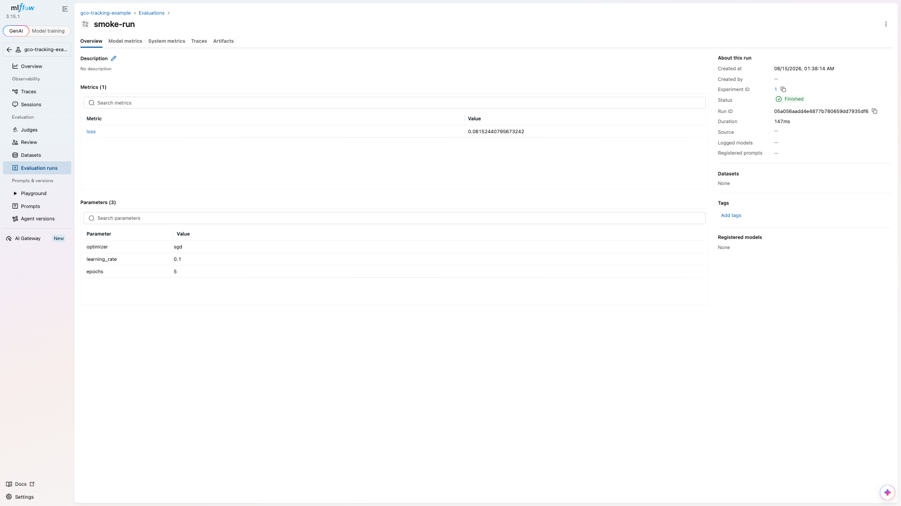
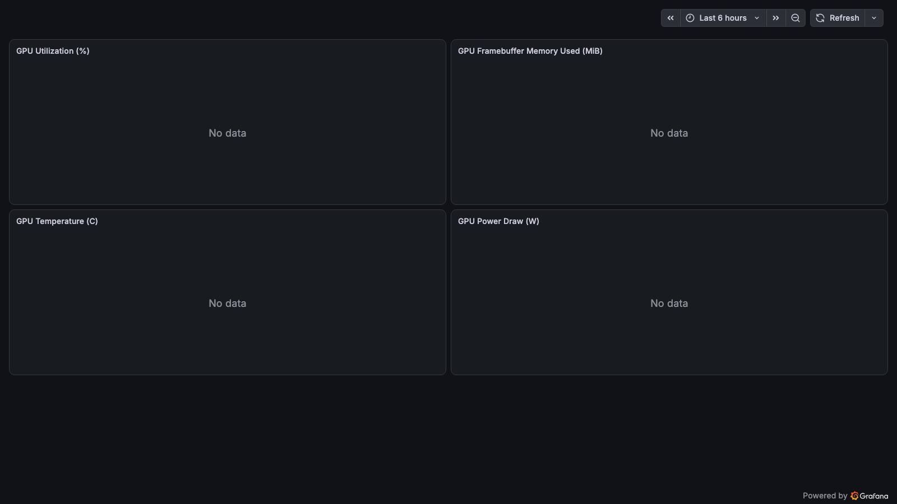
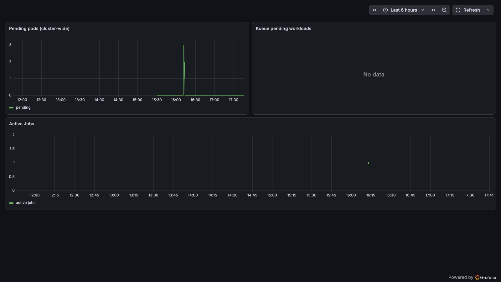
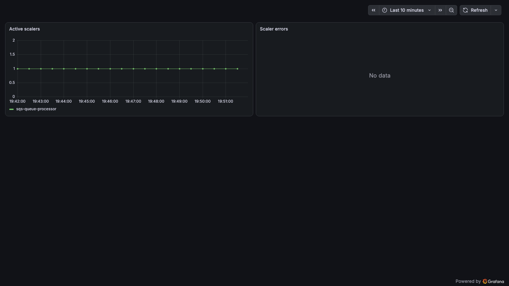
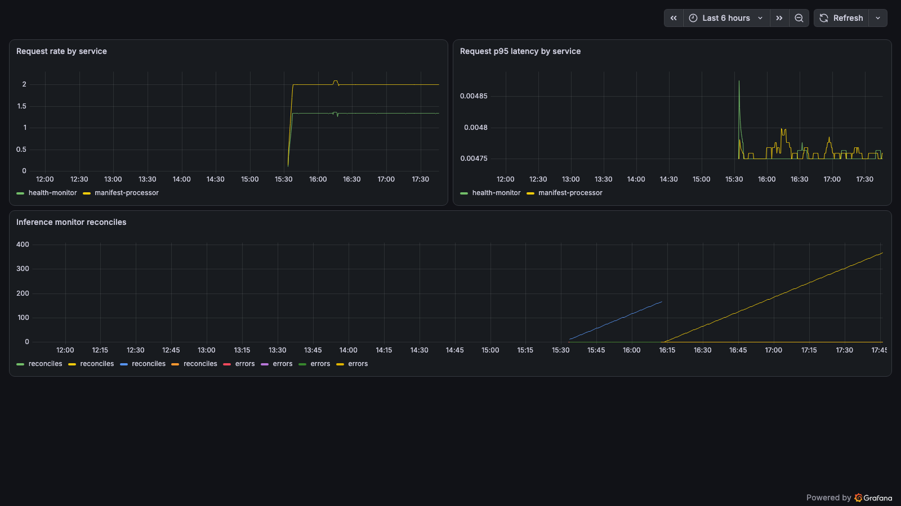

# Cluster Observability

In-cluster observability installs a self-hosted
[`kube-prometheus-stack`](https://github.com/prometheus-community/helm-charts/tree/main/charts/kube-prometheus-stack)
([Prometheus](https://prometheus.io/docs/introduction/overview/) + Alertmanager + [Grafana](https://grafana.com/docs/grafana/latest/) + `kube-state-metrics` + `node-exporter` +
the Prometheus Operator) on **every regional EKS cluster**, through the existing
Helm-installer pipeline. It answers "what is happening **inside** this cluster
right now" at Prometheus resolution — per-GPU DCGM series, scheduler queue depth,
[KEDA](https://keda.sh/) scaler lag, and per-pod GCO service metrics.

Unlike most optional features, cluster observability is **on by default**. A
stock deployment installs it in each region; operators opt out with
`gco monitoring disable` (or `cluster_observability.enabled = false` in
`cdk.json`).

> **Region placeholders.** Examples use `us-east-1` for a regional cluster.
> Substitute your own regions from `deployment_regions.regional` in `cdk.json`.

## Table of Contents

- [Relationship to the CloudWatch monitoring stack](#relationship-to-the-cloudwatch-monitoring-stack)
- [Cost](#cost)
- [What it provisions](#what-it-provisions)
- [Enabling and disabling](#enabling-and-disabling)
- [Accessing Grafana on a private cluster](#accessing-grafana-on-a-private-cluster)
- [Managing Grafana users](#managing-grafana-users)
- [Admin credential rotation](#admin-credential-rotation)
- [MLflow experiment tracking](#mlflow-experiment-tracking)
- [Curated dashboards](#curated-dashboards)
- [Dashboard screenshots](#dashboard-screenshots)
- [Distributed tracing](#distributed-tracing)

## Relationship to the CloudWatch monitoring stack

GCO ships **three** complementary observability surfaces:

- **`gco-monitoring` (CloudWatch)** — a cross-region CloudWatch dashboard, alarm,
  and SNS surface. It answers "is the platform up, are alarms firing, what does
  the fleet look like across regions" using AWS-native metrics (Global
  Accelerator, API Gateway, Lambda, SQS, DynamoDB, Container Insights node/GPU
  aggregates). This stack is unaffected by the `cluster_observability` toggle.
- **Cluster observability (this feature)** — per-cluster Prometheus/Grafana at a
  cardinality CloudWatch does not surface: per-GPU DCGM series, scheduler queue
  depth, KEDA scaler lag, per-pod GCO service RED metrics.
- **[Distributed tracing](#distributed-tracing)** — OpenTelemetry spans from the
  four API services in AWS X-Ray and CloudWatch Transaction Search, with the
  trace ids repeated on every service log line. It follows `cdk.json`
  `tracing`, not the `cluster_observability` toggle.

Reach for CloudWatch for cross-region platform health; reach for cluster
observability to debug what one cluster is doing in detail, and for traces to
follow one request across the services.

## Cost

Cluster observability is **on by default**, so its cost applies to every regional
cluster unless you opt out. The drivers, per region:

- **EBS (gp3) persistent volumes** — Prometheus TSDB (default `50Gi`), Grafana
  database + dashboards (`10Gi`), and Alertmanager (`5Gi`). These are the
  standing cost: roughly the gp3 rate for ~65 GiB per region, plus snapshots if
  you enable them. Sizes are configurable under
  `cluster_observability.{prometheus,grafana,alertmanager}.persistence_size`, and
  Prometheus retention (default `15d`) bounds how much of the 50 GiB fills.
- **Compute** — the component pods (Prometheus, Grafana, Alertmanager, operator,
  `kube-state-metrics`) plus a `node-exporter` and DCGM-exporter DaemonSet pod on
  each node. These are small (tens to low-hundreds of millicores) but scale with
  node count because the DaemonSets run one pod per node.
- **Data transfer** — scrape traffic stays in-cluster (no cross-AZ storage
  reads), so egress cost is negligible. There is no public endpoint and no ALB,
  so no load-balancer hours.

To eliminate the cost entirely, `gco monitoring disable` then redeploy — the
stack and its EBS volumes are removed. See also
[`docs/ARCHITECTURE.md`](ARCHITECTURE.md#cost-optimization).

## What it provisions

Per regional cluster, when enabled:

- The `kube-prometheus-stack` chart in the `monitoring` namespace (Prometheus,
  Alertmanager, Grafana, `kube-state-metrics`, `node-exporter`, operator).
- A gated `gco-observability-gp3` StorageClass backing the persistent volumes.
- `ServiceMonitor`s for the schedulers/operators (KEDA, [Volcano](https://volcano.sh/), [Kueue](https://kueue.sigs.k8s.io/), [KubeRay](https://docs.ray.io/en/latest/cluster/kubernetes/index.html),
  [YuniKorn](https://yunikorn.apache.org/)) and the DCGM GPU exporter, plus `PodMonitor`s for the GCO services
  (health-monitor, manifest-processor, inference-proxy, inference-monitor),
  which expose Prometheus `/metrics`. The GCO scrapes are HTTPS verified
  against the GCO internal CA: Prometheus reads the CA from the `ca.crt` key of
  the `gco-monitoring-trust` Secret and checks each pod's certificate against
  its Service name (`serverName: <service>.gco-system.svc`). The API services
  serve `/metrics` on their TLS sidecar (`https`, 8443); the inference monitor
  binds its plaintext endpoint to pod loopback (`127.0.0.1:9090`) and serves
  it through a `metrics-tls-proxy` sidecar on 9443 (`https-metrics`). See
  [In-cluster TLS](ARCHITECTURE.md#in-cluster-tls).
- TLS sidecars in three chart pods, for in-cluster clients: Grafana's
  `grafana-tls-proxy` (3443, the `grafana-tls` Service the credential rotator
  calls), OpenCost's `opencost-tls-proxy` (9443, the `opencost-tls` Service
  the cost monitor calls) and MLflow's `mlflow-tls-proxy` (5443, the
  `mlflow-tls` Service job pods log runs to). They run from a GCO service
  image, which is built for amd64 only, so those pods carry a
  `kubernetes.io/arch: amd64` node selector. `gco monitoring open` still
  port-forwards to the charts' own Services. Grafana's Deployment uses the `Recreate` strategy: its single
  replica owns a ReadWriteOnce volume, so a rolling update could never attach
  the volume to a surge pod on another node, and a rollout is a brief restart
  instead. Grafana (100m / 512Mi) and Prometheus (200m / 1Gi) carry resource
  requests, without limits, that the chart does not set by default: without
  them the scheduler treats both as free and packs them onto the densest
  general-purpose node, which EKS Auto Mode's 2-vCPU/4 GiB nodes cannot
  absorb (see the comment in `lambda/helm-installer/charts.yaml`).
- A standalone DCGM exporter DaemonSet on GPU nodes for per-GPU metrics.
- Curated Grafana dashboards (see [below](#curated-dashboards)).
- A credential-rotation CronJob (see
  [Admin credential rotation](#admin-credential-rotation)).
- When cost monitoring is enabled (the default), an
  [OpenCost](https://opencost.io/) release in the same `monitoring` namespace
  that reads this Prometheus and powers the *GCO Cost (OpenCost)* dashboard
  plus the cost report pipeline — see
  [COST_MONITORING.md](COST_MONITORING.md).
- When MLflow is enabled (the default), an [MLflow](https://mlflow.org/)
  tracking server in the same `monitoring` namespace — see
  [MLflow experiment tracking](#mlflow-experiment-tracking).

Grafana uses **Grafana-native authentication** (its own user database) with self
sign-up and anonymous access disabled. All three UIs (Grafana, Prometheus,
Alertmanager) are `ClusterIP` Services — there is **no public endpoint**.

## Enabling and disabling

```bash
gco monitoring status              # show the current cdk.json toggle + config
gco monitoring disable             # opt out (removed on next deploy)
gco monitoring enable              # opt back in
gco stacks deploy gco-us-east-1    # apply the change to a region
```

`enable` / `disable` only edit `cdk.json`; the change takes effect on the next
`gco stacks deploy` (or `deploy-all`).

## Accessing Grafana on a private cluster

The EKS API endpoint defaults to **PRIVATE** (`eks_cluster.endpoint_access =
"PRIVATE"`), and Grafana has no public endpoint. Access is therefore a
`kubectl port-forward` over an authenticated session to the private API server —
which means you must first have network reachability into the VPC (VPN, bastion,
or AWS Systems Manager). `gco monitoring open` handles the forward and can build
the SSM tunnel for you:

```bash
# From inside the VPC (VPN / bastion / Cloud9): the endpoint is reachable, so a
# plain forward works. Browse http://localhost:3000.
gco monitoring open --region us-east-1

# From a laptop with no VPC route: tunnel to the private API endpoint through an
# existing SSM-managed instance, then port-forward Grafana over that tunnel.
gco monitoring open --region us-east-1 --via-ssm i-0123456789abcdef0

# No SSM instance handy? Let the CLI provision a self-terminating ephemeral
# bastion for the session and tear it down when you stop the forward.
gco monitoring open --region us-east-1 --via-ssm auto
```

`--via-ssm <id>` opens an `AWS-StartPortForwardingSessionToRemoteHost` session to
the cluster's API endpoint on a local port, then runs `kubectl port-forward`
against `https://127.0.0.1:8443` with the real endpoint as the TLS server name.
It requires the [Session Manager plugin](https://docs.aws.amazon.com/systems-manager/latest/userguide/session-manager-working-with-install-plugin.html)
locally and an SSM-managed instance in the VPC that can reach the endpoint.

`--via-ssm auto` provisions that instance for you: a minimal `t3.micro` (with
automatic fallback through `t3a.micro`, `t3.small`, then `t2.micro` when the
preferred type isn't launchable in the Region or AZ) in the
cluster VPC that reuses the cluster security group (no new security group, and
**no inbound ports** — SSM is agent-initiated outbound only), requires IMDSv2,
self-terminates after `--bastion-ttl-minutes` (default 120), and is tagged
`gco:ephemeral=true`. It is torn down automatically when you stop the forward,
and on a teardown failure the command prints the exact orphan-check command. The
same ephemeral-bastion tunnelling is available for general `kubectl` access via
[`gco cluster tunnel`](CLI.md#gco-cluster-tunnel).

Other components:

```bash
gco monitoring open --service prometheus --region us-east-1     # localhost:9090
gco monitoring open --service alertmanager --region us-east-1   # localhost:9093
```

If the endpoint is private and you pass no `--via-ssm`, `open` prints the
SSM/VPN/bastion options and still attempts the forward in case you already have
connectivity. To allow direct kubectl from outside the VPC instead, set
`eks_cluster.endpoint_access` to `PUBLIC_AND_PRIVATE` and redeploy (less secure).

On a `PUBLIC_AND_PRIVATE` cluster, `open` uses the public endpoint unless you
pass `--via-ssm`. With `--via-ssm <id>` or `--via-ssm auto` it tunnels to the
private endpoint instead. Use that when the public endpoint's CIDR allowlist
does not cover every egress IP your network uses, so kubectl works on some
attempts and times out on others. `open` prints a `Route:` line naming the path
it took, and prints the local URL only after kubectl reports its listener. If
kubectl gives up first, `open` exits non-zero and tears down the tunnel and any
bastion. The same rules apply to every command that takes `--via-ssm`; see
[Route selection](CLI.md#route-selection).

## Managing Grafana users

Grafana uses its own user database, so users are managed through Grafana's admin
HTTP API rather than Cognito. These commands talk to Grafana over an active
`gco monitoring open` port-forward (default `http://localhost:3000`); the admin
credential is read from the chart-generated `kube-prometheus-stack-grafana`
Secret, or passed with `--admin-password` / `$GCO_GRAFANA_ADMIN_PASSWORD`.

```bash
# In one terminal:
gco monitoring open --region us-east-1 --via-ssm i-0123456789abcdef0

# In another:
gco monitoring users list
gco monitoring users add --username alice --email alice@example.com --generate-password
gco monitoring users remove --username alice --yes
```

## Admin credential rotation

The Grafana subchart auto-generates a strong random admin password into the
`kube-prometheus-stack-grafana` Secret on install; GCO never authors it. A
scheduled in-cluster `CronJob` (`gco-grafana-admin-password-rotation`, in the
`monitoring` namespace) then rotates it so the standing credential is refreshed
rather than living unchanged for the cluster's lifetime.

The CronJob resets the live password through Grafana's admin API and updates the
Secret that `gco monitoring users` reads (a restart cannot rotate it — Grafana
persists the password in its own database and only seeds it from the environment
on first start). Its ServiceAccount is least-privilege: `get`/`patch` on that one
Secret, no `pods/exec`, no AWS permissions. The admin API calls carry the admin
credential, so they go over verified HTTPS to the `grafana-tls` Service
(`https://grafana-tls.monitoring.svc.cluster.local:3443`, the Grafana pod's TLS
sidecar); the rotator trusts only the GCO internal CA, projected from the
`gco-monitoring-trust` Secret, and fails before reading any credential when
that CA is missing.

The cadence is configurable and defaults to monthly:

```json
"cluster_observability": {
  "grafana": { "admin_password_rotation_schedule": "0 4 1 * *" }
}
```

Rotation is transparent to the CLI, which always re-reads the current password
from the Secret.

## MLflow experiment tracking

An [MLflow](https://mlflow.org/) tracking server ships with the observability
bundle for experiment tracking from any workload on the cluster (see
[DISTRIBUTED_TRAINING.md](DISTRIBUTED_TRAINING.md) for the training side).
GCO deploys MLflow's [official Helm chart](https://mlflow.org/docs/latest/self-hosting/kubernetes-helm/)
(`oci://ghcr.io/mlflow/charts/mlflow`) with the official server image, both
pinned in `lambda/helm-installer/charts.yaml`.

**Toggle.** Controlled by `cluster_observability.mlflow.enabled` in `cdk.json`
(default `true`), effective only while `cluster_observability.enabled` is also
true — the server lives in the `monitoring` namespace, stores metadata on the
observability gp3 StorageClass, and is reached through the same tunnel
commands, so disabling observability switches MLflow off with it.

**Storage.** Run *artifacts* go to the cluster-shared S3 bucket under
`mlflow-artifacts/<region>/` through a dedicated IAM role scoped to exactly
that prefix (IRSA on the server's service account); the server proxies
artifact traffic, so client pods never need S3 credentials of their own. Run
*metadata* is SQLite on a chart-managed gp3 EBS volume
(`cluster_observability.mlflow.persistence_size`, default `10Gi`). Disabling
MLflow deletes the metadata volume on the next deploy — artifacts in S3
survive.

**Access.** Both Services are `ClusterIP` only — no Ingress, no public
endpoint. Jobs use the HTTPS front door,
`https://mlflow-tls.monitoring.svc.cluster.local:5443` (see *Logging from a
job* below); the chart's own `mlflow.monitoring:5000` serves the probes, the
Prometheus scrape and the tunnel:

```bash
gco monitoring open --service mlflow                  # http://localhost:5000
gco monitoring open --service mlflow --via-ssm auto   # no VPC route? ephemeral bastion
```



The run above is the one
[`examples/mlflow-tracking-job.yaml`](../examples/mlflow-tracking-job.yaml)
logs, captured through the tunnel command above.

> **Host-header allow-list.** MLflow 3.x validates the `Host` header and
> rejects anything it does not recognize with a 403 ("possible DNS rebinding
> attack detected"). Setting `--allowed-hosts` REPLACES its built-in
> localhost/private-IP allowance rather than extending it, so GCO's list
> carries every spelling that legitimately reaches the server: the in-cluster
> service DNS (with and without the port, for both `mlflow` and `mlflow-tls`,
> whose sidecar relays the client's `Host` header unchanged), the loopback
> spellings this tunnel forwards to, and a wildcard per `vpc_endpoint_cidrs`
> entry so Prometheus can scrape the pod IP. The list is assembled at deploy time from that one
> `cdk.json` key (see `_mlflow_allowed_hosts` in `gco/stacks/regional_stack.py`)
> — arbitrary DNS names stay rejected, and `/health` is exempt so probes never
> depend on it.

**Auth posture.** The server runs without application-level authentication —
the same posture as the OpenCost UI: it is reachable only from inside the
cluster (workloads opt in via a NetworkPolicy label, and a GCO-owned
NetworkPolicy fences the server pod itself — ingress on the server port and
the TLS port from in-cluster pods and the VPC CIDRs, egress limited to DNS and
443) and through the authenticated SSM/port-forward tunnel, which is the
security boundary. The chart supports MLflow's basic-auth plugin
(`server.value_options.app_name` plus a Secret-backed CSRF key — see the chart
docs) if your deployment needs an additional in-cluster boundary.

**Logging from a job.** Point the client at
`https://mlflow-tls.monitoring.svc.cluster.local:5443`, trust the GCO internal
CA, and opt into egress with the `gco.io/mlflow-client: "true"` pod label. The
CA comes from the ConfigMap `gco-internal-ca` in `gco-jobs`, which
[trust-manager](https://cert-manager.io/docs/trust/trust-manager/) (installed
with MLflow) publishes and keeps current: mount it and set
`MLFLOW_TRACKING_SERVER_CERT_PATH` to its `ca.crt`. The label admits the
server's HTTPS port (5443) only.
[`examples/mlflow-tracking-job.yaml`](../examples/mlflow-tracking-job.yaml)
is the complete, validated pattern (it logs a run, reads it back through the
API, and asserts every value round-tripped). See
[In-cluster TLS](ARCHITECTURE.md#in-cluster-tls) for how the bundle is built.

## Curated dashboards

Four GCO dashboards are imported automatically by the Grafana sidecar (they are
ConfigMaps labeled `grafana_dashboard: "1"`), alongside the stock
kube-prometheus-stack cluster/node/pod dashboards:

- **GCO GPU (DCGM)** — per-GPU utilization, framebuffer memory, temperature, and
  power draw.
- **GCO Schedulers & Queues** — pending pods, Kueue pending workloads, active
  Jobs.
- **GCO KEDA Autoscaling** — active scalers and scaler errors.
- **GCO Services** — request rate and p95 latency per GCO service, plus inference
  monitor reconcile/error counts.

With cost monitoring enabled (the default) a fifth dashboard, **GCO Cost
(OpenCost)**, is imported the same way; open it directly with
`gco costs dashboard` (see [COST_MONITORING.md](COST_MONITORING.md#accessing-the-cost-dashboards)).

## Dashboard screenshots

The four curated dashboards, captured from a live regional cluster. The cluster
was largely idle with no GPU nodes, so these are intentionally light on data —
GPU panels honestly show "No data" and the others show modest control-plane
activity. They demonstrate the panels and layout you get out of the box. The
cost surfaces — the *GCO Cost (OpenCost)* Grafana dashboard and the native
OpenCost UI — are shown in
[COST_MONITORING.md](COST_MONITORING.md#accessing-the-cost-dashboards).

### GCO GPU (DCGM)



Per-GPU utilization, framebuffer memory, temperature, and power draw. "No data"
is expected when the cluster has no GPU nodes.

### GCO Schedulers & Queues



Pending pods (cluster-wide), Kueue pending workloads, and active Jobs.

### GCO KEDA Autoscaling



Active scalers and scaler errors.

### GCO Services



Request rate and p95 latency per GCO service, plus inference-monitor
reconcile/error counts.

These images are regenerated on demand after a dashboard change. Grafana is
private, so first port-forward it — `gco monitoring open` can auto-provision a
self-terminating ephemeral bastion (`--via-ssm auto`) — then run the [Playwright](https://playwright.dev/python/docs/intro)
capture script:

```bash
gco monitoring open --region us-east-1 --via-ssm auto   # one shell (auto bastion)
playwright install chromium                             # once
python scripts/capture_monitoring_screenshots.py \
    --username admin --password "$GCO_GRAFANA_ADMIN_PASSWORD"
```

The capture script writes one PNG per curated dashboard (including
`grafana-cost.png`, embedded in
[COST_MONITORING.md](COST_MONITORING.md#accessing-the-cost-dashboards)) to the
repo's [`images/`](../images/) directory; pass
`--opencost-url http://localhost:9091` (with an
`gco monitoring open --service opencost` tunnel up) to also capture the native
OpenCost UI as `opencost-ui.png`.

## Distributed tracing

The four GCO API services — `health-monitor`, `manifest-processor`,
`inference-proxy`, and `cost-monitor` — record [OpenTelemetry](https://opentelemetry.io/docs/)
traces and export them to [AWS X-Ray](https://docs.aws.amazon.com/xray/latest/devguide/aws-xray.html),
which stores them through [CloudWatch Transaction Search](https://docs.aws.amazon.com/AmazonCloudWatch/latest/monitoring/CloudWatch-Transaction-Search.html)
as span events in the `aws/spans` log group of each regional Region. Tracing is
**on by default** with a 5% sample and is configured by the `tracing` block in
`cdk.json` ([CUSTOMIZATION.md](CUSTOMIZATION.md#distributed-tracing)). The
implementation is `gco/services/tracing.py`.

### What is traced

- **Server spans** for the requests each service handles, named by method and
  route (for example `GET /api/v1/jobs`). The probe and scrape paths
  `/healthz`, `/readyz`, `/metrics`, and `/api/v1/health` are excluded;
  `/api/v1/metrics` is an API route and is traced.
- **Client spans** for the in-cluster hops the services make, nested under the
  server span that caused them: manifest-processor → cost-monitor
  (`/api/v1/cost/*`), cost-monitor → OpenCost, and inference-proxy → model
  endpoints. Each client request carries a W3C `traceparent` header, so the
  cost monitor's server span joins the manifest processor's trace. Model
  servers receive the header as well; GCO configures no tracing inside model
  pods. The OpenCost calls of the cost monitor's scheduled reports happen
  outside any request, so their client spans start traces of their own.
- Spans carry the standard HTTP attributes (method, route, URL path and query,
  status code, user agent) and the resource attributes `service.name`,
  `service.namespace` (`gco`), `service.version`, `cloud.region`,
  `k8s.cluster.name`, `k8s.namespace.name`, and `k8s.pod.name`. No other
  request or response headers are captured, and no bodies.
- **Not traced:** the health monitor's webhook deliveries (webhook URLs often
  carry credentials in their path or query, and a client span records the full
  URL), AWS SDK and Kubernetes API calls, the inference monitor, the queue
  processor, the Mooncake PD proxy, and the TLS sidecars.

### How spans reach X-Ray

Each service exports its own spans directly to the
[X-Ray OTLP endpoint](https://docs.aws.amazon.com/AmazonCloudWatch/latest/monitoring/CloudWatch-OTLPEndpoint.html),
`https://xray.<region>.amazonaws.com/v1/traces`: OTLP/HTTP protobuf batches,
gzip-compressed and signed with SigV4 by the service's own IAM role, with the
credentials resolved again for every attempt so rotated keys are picked up. The
SDK's batch processor sends from a background thread. A throttled request, a
server error, or a transport error is retried with a short exponential backoff
inside a 10-second budget; a batch that still fails is dropped, and the warning
is logged at most once a minute with a count of the repeats it stands for.
Export never raises into request handling, the exporter's own HTTP client is
never traced, and each service flushes its queued spans when it shuts down. A
service that cannot trace (no Region, no credentials, a package missing from
its image) logs one warning at startup and serves untraced. Spans usually
appear in `aws/spans` within a few minutes.

There is deliberately no collector. The services already have what direct
export needs: HTTPS egress to AWS APIs, which the `gco-system` NetworkPolicies
allow, and one IAM role each. Relaying through the CloudWatch agent that the
CloudWatch Observability add-on runs would add a plaintext OTLP hop out of
`gco-system`, a NetworkPolicy path for it, and one shared agent identity in
place of the per-service roles. A third-party tracing service would send span
data, URL paths and queries included, outside AWS and need an API key stored in
the cluster; with X-Ray the spans stay in the account's CloudWatch Logs, under
its IAM policies and retention settings.

The endpoint host is the `amazonaws.com` form, and the manifests do not set the
`GCO_TRACING_ENDPOINT` override. In a partition whose endpoints use another
domain, or where Transaction Search is not available, set `tracing.enabled` to
`false`.

### Sampling

Sampling is decided at the head of a trace from its trace ID, with probability
`tracing.sample_ratio` (default `0.05`). The same trace-ID-ratio sampler applies
to requests that start a trace and to requests that arrive with a parent from
another GCO service, and every hop reaches the same decision from the same trace
ID, so a trace is kept or dropped whole: a sampled manifest-processor span
always has its cost-monitor child. A `traceparent` sampled flag from a caller can
neither force nor suppress recording.

External callers cannot inject trace context in the first place. The API Gateway
Lambda proxies forward an allowlist of request headers that does not include
`traceparent`, and the services read only W3C trace context (not the
`X-Amzn-Trace-Id` header the ALB adds), so every trace starts at the first GCO
service a request reaches and is not joined to the Lambda functions' own X-Ray
traces. [Release validation](LIVE_RELEASE_VALIDATION.md#tracing-and-transaction-search)
raises the ratio to `1.0` for its run through the `tracing_overrides` context.

### Correlating logs with traces

While tracing is active, every JSON log line a service writes inside a request
carries `trace_id` (32 hex digits), `span_id` (16 hex digits), and
`trace_sampled`. Unsampled requests keep their ids (`trace_sampled: false`), and
the trace id is the same in every service a request crosses, so log lines
correlate across services even when no span was exported. Container logs reach
CloudWatch Logs through the CloudWatch Observability add-on; in CloudWatch Logs
Insights, on the cluster's `/aws/containerinsights/<cluster>/application` log
group, one request's lines across all services are:

```text
fields @timestamp, @logStream, @message
| filter @message like "4bf92f3577b34da6a3ce929d0e0e4736"
| sort @timestamp asc
```

When `trace_sampled` is true, the same id finds the request's spans in
`aws/spans`.

### Transaction Search

The X-Ray OTLP endpoint accepts spans only once CloudWatch Transaction Search is
on. Each regional stack therefore carries a custom resource
([`lambda/transaction-search`](../lambda/transaction-search/README.md)) that
switches it on in its Region while `tracing.enabled` and
`tracing.enable_transaction_search` are both true (the default):

- When the X-Ray trace segment destination is already `CloudWatchLogs` (active,
  or pending a switch someone else started), nothing changes.
- Otherwise it writes the CloudWatch Logs resource policy
  `gco-transaction-search-xray-access` (principal `xray.amazonaws.com`,
  `logs:PutLogEvents` on the `aws/spans` and `/aws/application-signals/data`
  log groups of that Region, conditioned on this account's X-Ray through
  `aws:SourceArn` and `aws:SourceAccount`), then sets the destination to
  `CloudWatchLogs`. X-Ray can take about 10 minutes to report the destination
  `ACTIVE` and make spans searchable.
- It never changes the span indexing rule, so the account keeps AWS's default
  of 1% of spans indexed as trace summaries, or whatever you set.
- Delete is a no-op: destroying a stack never turns Transaction Search off and
  never removes the policy. The resource runs again only when its properties
  change, so re-enable Transaction Search in the console if it is switched off
  out of band.

Transaction Search is an account-level setting configured per Region and shared
with every other workload that sends traces to X-Ray there. Turning it on moves
all X-Ray span ingestion in that account and Region to CloudWatch Logs pricing,
including the traces of GCO's own Lambda functions (they run with X-Ray active
tracing) and of any other application. Set `tracing.enable_transaction_search`
to `false` when your organization manages the setting, or in a partition where
it is unavailable; the services then export successfully only once someone
else has enabled it. A failed enablement fails the stack operation with an
error that names this opt-out.

### Querying spans

In the CloudWatch console, **Application Signals → Transaction Search**
searches and groups spans by any attribute; filter on `service.name` for one
GCO service. The spans are also log events in `aws/spans`, so CloudWatch Logs
Insights queries them directly. The slowest GCO spans in the selected window
(`durationNano` is in nanoseconds):

```text
fields @timestamp, `resource.attributes.service.name` as service, name, durationNano, traceId
| filter `resource.attributes.service.namespace` = "gco"
| sort durationNano desc
| limit 20
```

Every span of one trace, for example the `trace_id` from a log line:

```text
fields @timestamp, `resource.attributes.service.name` as service, name, durationNano
| filter traceId = "4bf92f3577b34da6a3ce929d0e0e4736"
| sort @timestamp asc
```

### Permissions

- The health-monitor, manifest-processor, inference-proxy, and (with cost
  monitoring) cost-monitor roles each get one write-only statement:
  `xray:PutTraceSegments` and `xray:PutSpans` on `Resource: *`, because X-Ray
  supports no resource-level scoping for them (acknowledged in cdk-nag with that
  reason). Nothing is granted while `tracing.enabled` is false, and the TLS
  sidecars hold no AWS credentials at all.
- The Transaction Search Lambda's role carries the permissions AWS lists for
  enabling Transaction Search, minus the indexing-rule APIs GCO never calls;
  the list is in its [README](../lambda/transaction-search/README.md#iam-permissions).

### Tracing cost

Spans are billed as CloudWatch Logs ingestion and storage in `aws/spans` (see
[CloudWatch pricing](https://aws.amazon.com/cloudwatch/pricing/)); indexing 1%
of them as trace summaries is free. Spend scales with request volume times
`sample_ratio`: a sampled request produces one server span, plus a client span
for each in-cluster hop it makes and the spans of the service it reaches (a cost
route adds the cost monitor's server span and its OpenCost client spans). GCO
does not create, configure, or delete the `aws/spans` log group and sets no
retention on it; it is shared by every span producer in the Region, so choose
its retention with that in mind. Without an `xray` VPC endpoint, export
traffic also passes the NAT gateways.

### Turning tracing off

Set `tracing.enabled` to `false` in `cdk.json` and redeploy the regional stacks.
The four Deployments then render `GCO_TRACING_ENABLED: "false"` (the SDK stays
inert and exports nothing), the X-Ray grants are removed, and the Transaction
Search resource is dropped, which leaves Transaction Search itself on. To turn
Transaction Search off once nothing else in the account and Region depends on
it, use the CloudWatch console (**Application Signals → Transaction Search**)
or `aws xray update-trace-segment-destination --destination XRay`, then remove
the policy with
`aws logs delete-resource-policy --policy-name gco-transaction-search-xray-access`.

`sample_ratio: 0` is the lighter alternative: nothing is exported, while log
lines keep their request-scoped trace ids.

### Application Signals auto-instrumentation

The regional stack configures the CloudWatch Observability add-on to exclude
`gco-system` and `gco-inference` from Application Signals auto-monitoring for
every language it instruments (Java, Python, .NET, Node.js), whatever the
`tracing` setting. Auto-monitoring injects ADOT auto-instrumentation into
matching workloads: in `gco-system` it would instrument the API services a
second time, and in `gco-inference` it would change model pods that must run
exactly as the inference monitor renders them. Other namespaces keep the
add-on's behavior.

### Keeping span export private

Add `xray` to `vpc_endpoints.interface` in `cdk.json` to create a PrivateLink
interface endpoint (`com.amazonaws.<region>.xray`) whose private DNS answers
for the host the services export to, so span export stays inside the VPC
instead of passing the NAT gateways. Interface endpoints bill per AZ-hour; see
[VPC Endpoints](CUSTOMIZATION.md#vpc-endpoints).
