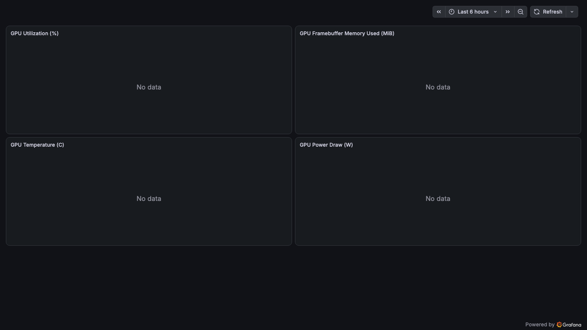
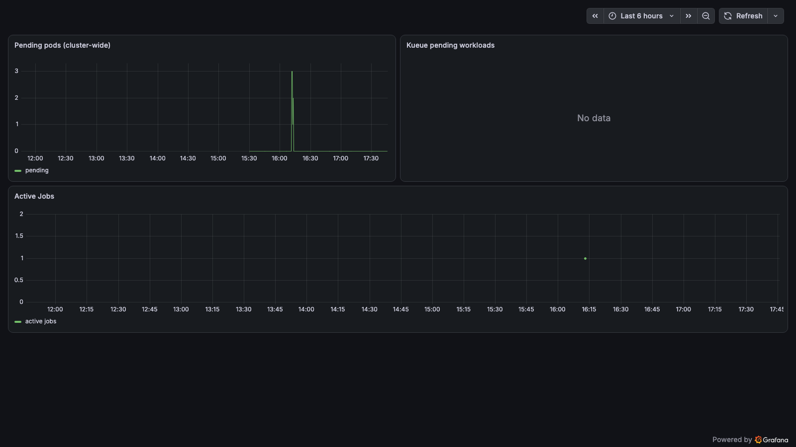
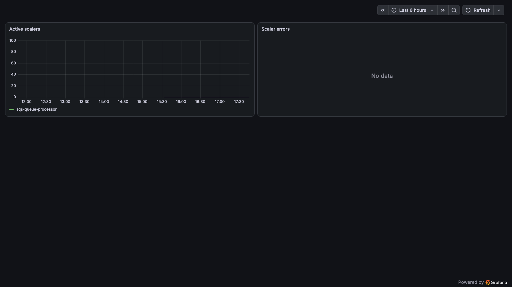
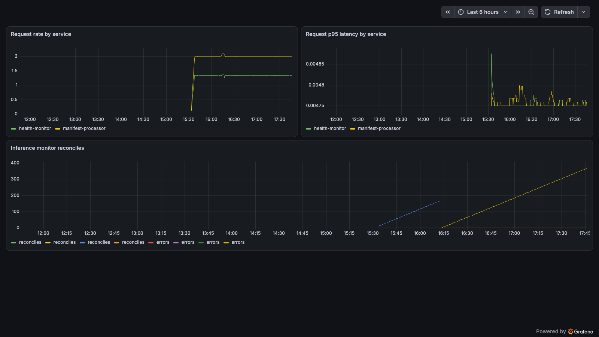

# Monitoring dashboard screenshots

Screenshots of the curated GCO Grafana dashboards used by
[`docs/MONITORING.md`](../../MONITORING.md). They are committed here and
**regenerated on demand** against a live cluster after a dashboard change (see
[Regenerate](#regenerate)). The committed set was captured from a largely idle
cluster with no GPU nodes, so it is intentionally light on data.

## Table of Contents

- [Regenerate](#regenerate)
- [Images](#images)

## Regenerate

Grafana is private (`ClusterIP`, no public endpoint), so first port-forward it,
then run the capture script:

```bash
# 1. Port-forward Grafana. The API endpoint is private, so tunnel through SSM —
#    `--via-ssm auto` provisions a self-terminating ephemeral bastion and tears
#    it down when you stop the forward (or pass an existing `--via-ssm <id>`):
gco monitoring open --region us-east-1 --via-ssm auto

# 2. In another shell, capture the dashboards (Chromium fetched once):
playwright install chromium
python scripts/capture_monitoring_screenshots.py \
    --username admin --password "$GCO_GRAFANA_ADMIN_PASSWORD"
```

## Images

The script writes one PNG per curated dashboard:

| File | Dashboard | Preview |
|------|-----------|---------|
| `grafana-gpu-dcgm.png` | GCO GPU (DCGM) |  |
| `grafana-schedulers.png` | GCO Schedulers & Queues |  |
| `grafana-keda.png` | GCO KEDA Autoscaling |  |
| `grafana-services.png` | GCO Services |  |

The dashboard set is kept in sync with
`lambda/kubectl-applier-simple/manifests/post-helm-grafana-dashboards.yaml` by
`tests/test_cluster_observability_screenshots.py`.
